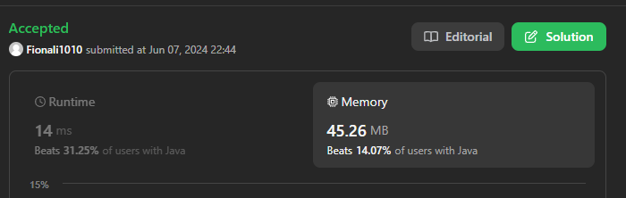

# 383. Ransom Note.md
## Appraoch 1 - HashMap


```java
class Solution {
    public boolean canConstruct(String ransomNote, String magazine) {
        HashMap<Character, Integer> map = new HashMap<>();

        for (char c: magazine.toCharArray()) {
            map.put(c, map.getOrDefault(c, 0)+1);
        }

        for (char c: ransomNote.toCharArray()) {
            if (map.get(c) != null && map.get(c) > 0) { // map.get(c) != null must be here
                map.put(c, map.get(c)-1);
            }else {
                return false;
            }
        }
        return true;
    }
}
```

## Approach 2 - Array

```java
class Solution {
    public boolean canConstruct(String ransomNote, String magazine) {
        int[] arr = new int[26];

        for (char c: magazine.toCharArray()) {
            arr[c - 'a'] ++;
        }

        for (char c: ransomNote.toCharArray()) {
            if (arr[c - 'a'] <= 0) {
                return false;
            } else {
                arr[c-'a']--;
            }
        }

        return true;
    }
}
```