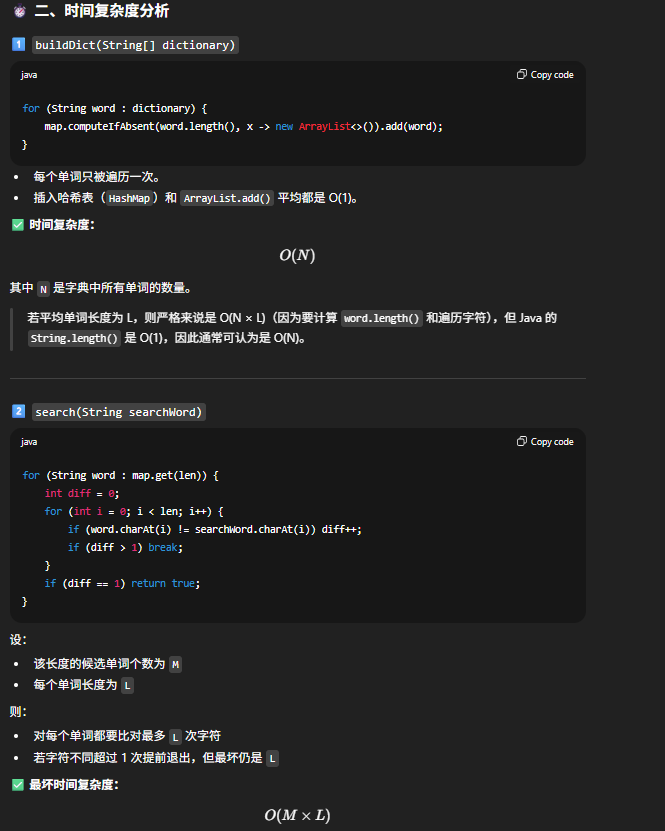
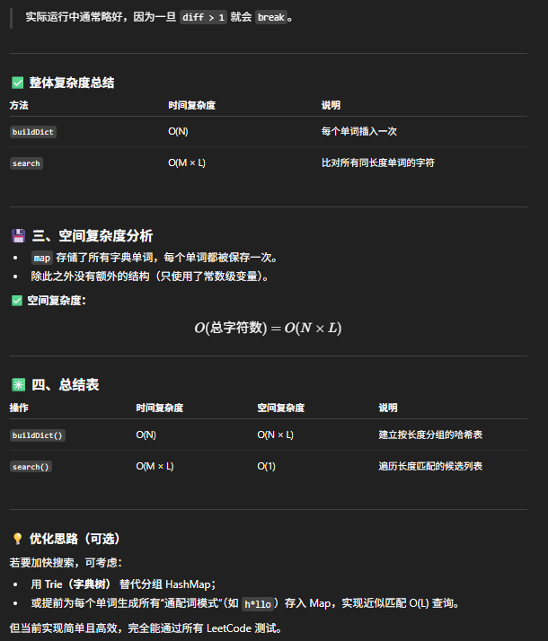

# 676. Implement Magic Dictionary


```java
class MagicDictionary {
    private Map<Integer, List<String>> map;

    public MagicDictionary() {
        map = new HashMap<>();
    }
    
    public void buildDict(String[] dictionary) {
        for (String word: dictionary) {
            map.computeIfAbsent(word.length(), x -> new ArrayList<>()).add(word);
        }
    }
    
    public boolean search(String searchWord) {
        int len = searchWord.length();
        if (!map.containsKey(len)) return false;

        for (String word: map.get(len)) {
            int diff = 0;
           
            for (int i = 0; i < len; i++) {
                if (word.charAt(i) != searchWord.charAt(i)) diff++;
                if (diff > 1) break;
            }
            if (diff == 1) return true;
        }

        return false;
    }
}

```

