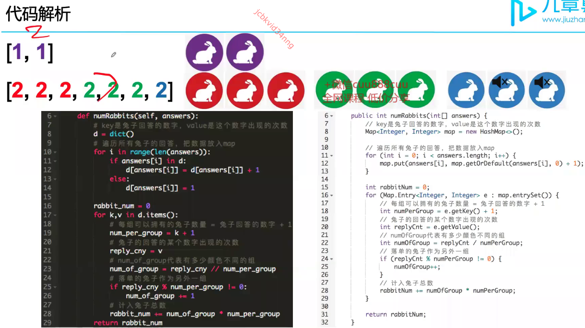

# Hash Map Learning Notes
## Set / HashSet

**Features:**
- set中元素没有重复
- set中元素没有顺序
- 增删查改time: O(1)

**Features:**
- 用于去重；
- 快速的增删查改；


Example: 


```java
import java.util.HashSet;
import java.util.Set;

public class Main {
    public static void main(String[] args) {
        int k = 2;
        int numsArr[] = {1, 7, 3, 4, 5};

        System.out.println(KDifference(numsArr,k));
    }

    public static int KDifference(int[] nums, int target) {
        int counter = 0;
        Set<Integer> set = new HashSet<>();

        for (int num : nums) {
            if (set.contains(num - target)) counter++;
            if (set.contains(num + target)) counter++;
            set.add(num);
        }
        return counter;
    }
}

// Time comlexity: O(n)
// the above codes only works when all array elements are unique
// if not unique, we should use 
```

## dic / HashMap


## 小技巧：前缀和 prefixSum
前缀和是累积量


)

适用于需要多次求解不同子数组之和。构建该前缀和数组为O(n)时间。 


```java
public static int searchSubarray(int[] arr, int k) {
    HashMap<Long, Integer> hashMap = new HashMap<>();
    hashMap.put((long)0, -1);
    long prefixSum = 0;

    for (int i = 0; i < arr.length; i++) {
        prefixSum += (long)arr[i];

        if (hashMap.containsKey(prefixSum-k))
            return i - hashMap.get(prefixSum-k);
        //如果hashMap里面已经存在prefixSum, 再遇到同样就不要覆盖，因为我们需要的位置靠前的subarray  
        if (!hashMap.containsKey(prefixSum)) 
            hashMap.put(prefixSum, i); //value 存放的是end index, 因为所有的prefixSum的其实位置都是一样的 -- 0
    }
    return -1;
}
```
 
 
 

 ```java
     public static int countRabbit(int[] answer) {
        HashMap<Integer, Integer> hashMap = new HashMap<>();
        for(int num:answer) {
            hashMap.put(num,hashMap.getOrDefault(num,0)+1);
        }

        int rabbitSum = 0;

        for(Map.Entry<Integer, Integer> e:hashMap.entrySet()) {
            int numPerGroup = e.getKey()+1;
            int replyCount = e.getValue();
            int numOfGroup = replyCount / numPerGroup;
            if(replyCount % numPerGroup != 0) {
                numOfGroup++;
            }
            rabbitSum += numOfGroup * numPerGroup;
        }
        return rabbitSum;
    }

    // by Lei
        public static int countRabit(int[] answer) {
        HashMap<Integer, Integer> hashMap = new HashMap<>();
        for (int num:answer) {
            if (!hashMap.containsKey(num))
                hashMap.put(num,1);
            else hashMap.put(num, hashMap.get(num)+1);
        }

        int sum = 0;
        for (int key:hashMap.keySet()) {
            int value = hashMap.get(key);
            if (value % (key+1) != 0) {
                hashMap.put(key,(value/(key+1)+1)*(key+1));
            }
            sum += hashMap.get(key);
        }
        return sum;
    }
 ```
 

 

