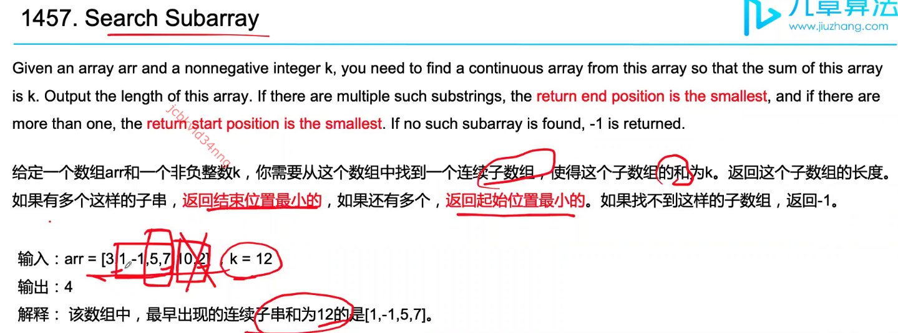

# Hash Map Learning Notes
## Set / HashSet

**Features:**
- set中元素没有重复
- set中元素没有顺序
- 增删查改time: O(1)

**Features:**
- 用于去重；
- 快速的增删查改；


Example: 


```java
import java.util.HashSet;
import java.util.Set;

public class Main {
    public static void main(String[] args) {
        int k = 2;
        int numsArr[] = {1, 7, 3, 4, 5};

        System.out.println(KDifference(numsArr,k));
    }

    public static int KDifference(int[] nums, int target) {
        int counter = 0;
        Set<Integer> set = new HashSet<>();

        for (int num : nums) {
            if (set.contains(num - target)) counter++;
            if (set.contains(num + target)) counter++;
            set.add(num);
        }
        return counter;
    }
}

// Time comlexity: O(n)
// the above codes only works when all array elements are unique
// if not unique, we should use 
```

## dic / HashMap


## 小技巧：前缀和 prefixSum
前缀和是累积量


)

适用于需要多次求解不同子数组之和。构建该前缀和数组为O(n)时间。 




 