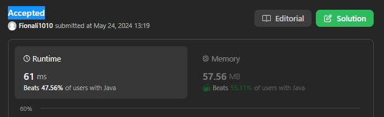
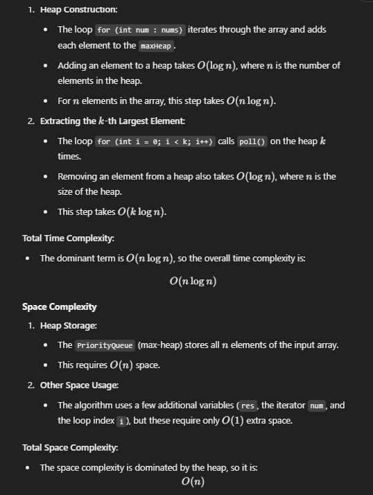
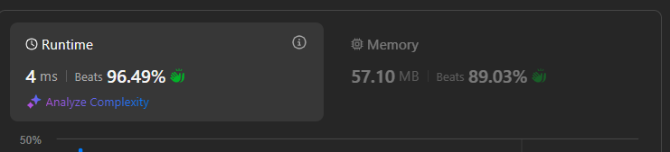
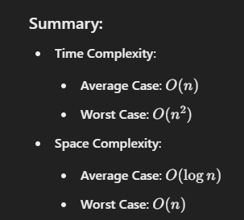

# 215. Kth Largest Element in an Array

## Appraoch 1 - heap/priorityQueue



```java
class Solution {
    public int findKthLargest(int[] nums, int k) {
        PriorityQueue<Integer> maxHeap = new PriorityQueue<>((a,b) -> b - a);
        int res = nums[0];

        for (int num: nums) {
            maxHeap.add(num);
        }

        for (int i = 0; i < k; i++) {
            res = maxHeap.poll();
        }

        return res;
    }
}
```


## Approach 2 - quickSort

```java
class Solution {
    public int findKthLargest(int[] nums, int k) {
        if (nums == null) {
            return -1;
        }

        return quickSelect(nums, 0, nums.length-1, k);
    }

    private int quickSelect(int[] nums, int start, int end, int k) {
        if (start == end) {
            return nums[start];
        }

        int i = start, j = end;
        int pivot = nums[start + (end - start)/2];
       
        while (i <= j) {
            while (i <= j && nums[i] > pivot) {
                i++;
            }

            while (i <= j && nums[j] < pivot) {
                j--;
            }

            if (i <= j) {
                swap(nums, i++, j--);
            }
        }

        // key code
        if (start + (k - 1) <= j) {
            return quickSelect(nums, start, j, k);
        }

        // if answer in the right half, k also needs to be adjusted to exclude number of elements bigger than answer, which are all the left half
        if (start + (k -1) >= i) {
            return quickSelect(nums, i, end, k - (i - start));
        }

        return nums[j+1];
    }

    private void swap(int[] nums, int i, int j) {
        int temp = nums[i];
        nums[i] = nums[j];
        nums[j] = temp;
    }

}
```
