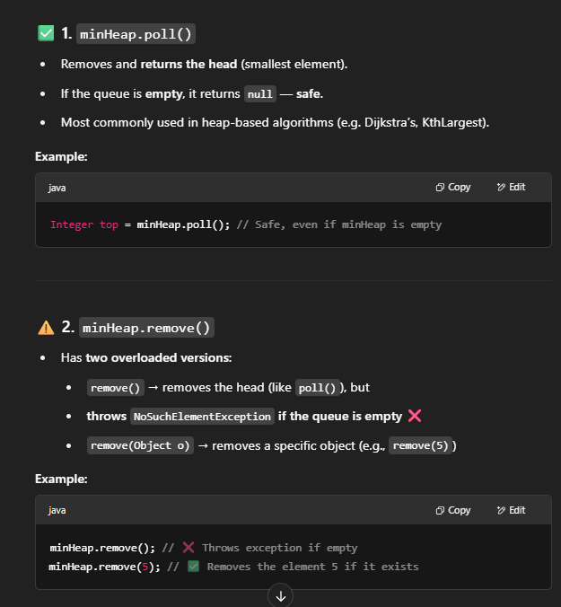

# 621. Task Schedule

## Approach 1 - maxHeap

- 要想到总是要先做数量多的task, 不然需要idle的时间会变多; 
- 这道题看似复杂，A,B,C...,其实关键是要理解一个cycle是 n+1的长度, 假设n = 2;
    - [A, -, -]
    - [A, -, -] 
    - 做了A之后要等到下一个cycle才可以做A, 这样就刚刚好不会idle
- 实在填不满cycle,才是idle的情况

```java
class Solution {
    public int leastInterval(char[] tasks, int n) {
        // step 1: construct frequency map
        int[] freq = new int[26];
        for (char c: tasks) {
            freq[c - 'A']++;
        }

        // step 2: contruct maxheap
        PriorityQueue<Integer> maxHeap  = new PriorityQueue<>((a,b) -> (b - a));
        for (int num: freq) {
            if (num > 0) maxHeap.offer(num);
        }

        // step 3
        int time = 0;
        while (!maxHeap.isEmpty()) {
            int cycle = n + 1;
            List<Integer> store = new ArrayList<>();
            int taskCount = 0;
            
            while(cycle-- > 0 && !maxHeap.isEmpty()) {
                int task = maxHeap.poll();
                taskCount++;
                task--
                if (task > 0) store.add(task); //如果task == 0,就没必要再放入heap, 已经做完该种task了
            }

            for (int num: store) {
                maxHeap.offer(num);
            }

            // time += n+1 除了最后一轮，直接+该轮实际的task数
            time += maxHeap.isEmpty()? taskCount: n+1; // 这里不能+cycle, cycle ！= n+1;
        }
        return time;
    }
}
```

## Approach 2 - sort

```java
class Solution {
    public int leastInterval(char[] tasks, int n) {
        int[] freq = new int[26];
        for (char c: tasks) {
            freq[c-'A']++;
        }
        Arrays.sort(freq);

        int time = 0;
        while (freq[25] > 0) {//每一轮都会重新sort, 如果最大的freq都是0，说明tasks已经全部做完了
            int i = 0;
            while (i < n+1 && freq[25] > 0) {
                int idx = 25-i;
                if (idx >= 0 && freq[idx] > 0) freq[idx]--;
                time++;
                i++;
            }   
            Arrays.sort(freq);
        }
        return time;
    }
}

```
