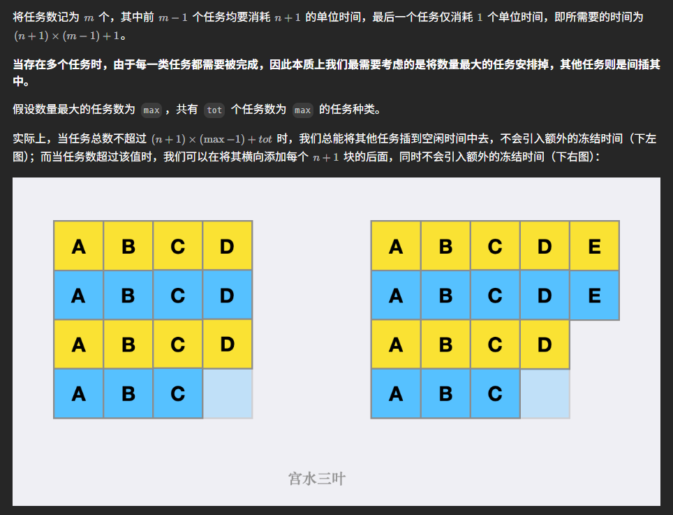

# 621. Task Schedule

## Approach 1 - 数学 (推荐)

https://leetcode.cn/problems/task-scheduler/solutions/1924711/by-ac_oier-3560/



```java
class Solution {
    public int leastInterval(char[] tasks, int n) {
        // 1. 统计每个单词的频率
        int[] freq = new int[26];
        for (int c: tasks) freq[c-'A']++;
        
        // 2. 最大频率是多少
        int maxFreq = Arrays.stream(freq).max().getAsInt();
        
        // 3. 有几个task是最大频率
        int maxCount = 0;
        for (int f: freq) {
            if (f == maxFreq) maxCount++;
        }

        // 4. 计算公式 (maxFreq-1) * (n+1) + maxCount)
        return Math.max(tasks.length, (maxFreq-1) * (n+1) + maxCount);
    }
}
```
- time: O(N + 26) = O(N)
- space: O(26) = O(1)

## Approach 2 - maxHeap (好理解，推荐)

- 要想到总是要先做数量多的task, 不然需要idle的时间会变多; 
- 这道题看似复杂，A,B,C...,其实关键是要理解一个cycle是 n+1的长度, 假设n = 2;
    - [A, -, -]
    - [A, -, -] 
    - 做了A之后要等到下一个cycle才可以做A, 这样就刚刚好不会idle
- 实在填不满cycle,才是idle的情况
- This simulates the actual scheduling process rather than calculating idle slots

```java
class Solution {
    public int leastInterval(char[] tasks, int n) {
        // step 1: calculate freq for each tasks
        int[] freq = new int[26];
        for (char task: tasks) freq[task-'A']++; 

        // step 2: contruct maxheap
        PriorityQueue<Integer> maxHeap  = new PriorityQueue<>((a,b) -> (b - a));
        for (int num: freq) {
            if (num > 0) maxHeap.offer(num);
        }

        // step 3: simulation
        int time = 0;
        while (!maxHeap.isEmpty()) {
            int cycle = n + 1;
            int taskCount = 0;
            List<Integer> store = new ArrayList<>();
            
              while (cycle > 0 && !maxHeap.isEmpty()) {
                int[] freq = maxHeap.poll();
                if (--freq > 0) list.add(freq);
                cycle--;
                taskCount++;
            }
            
            maxHeap.addAll(store);

            // If heap is empty (last cycle), only add the actual tasks executed
            // Otherwise, add the full cycle length n+1 (including any idle time)
            time += maxHeap.isEmpty()? taskCount: n+1; // 这里不能+cycle, cycle ！= n+1;
        }
        return time;
    }
}
```
- time: O(N * log26) ~ O(N)
- Space complexity: O(26) = O(1)

## Apprach 3 - Greedy （不好理解但快）

```java
public class Solution {
    public int leastInterval(char[] tasks, int n) {
        int[] freq = new int[26];
        for (char task : tasks) {
            freq[task - 'A']++;
        }

        Arrays.sort(freq); // sort in ascending order

        int maxFreq = freq[25];
        int idleSlots = (maxFreq - 1) * n;

        // fill idle slots with the rest of the tasks
        for (int i = 24; i >= 0 && idleSlots > 0; i--) {
            idleSlots -= Math.min(freq[i], maxFreq - 1);
        }

        idleSlots = Math.max(0, idleSlots);

        return tasks.length + idleSlots;
    }
}
```


