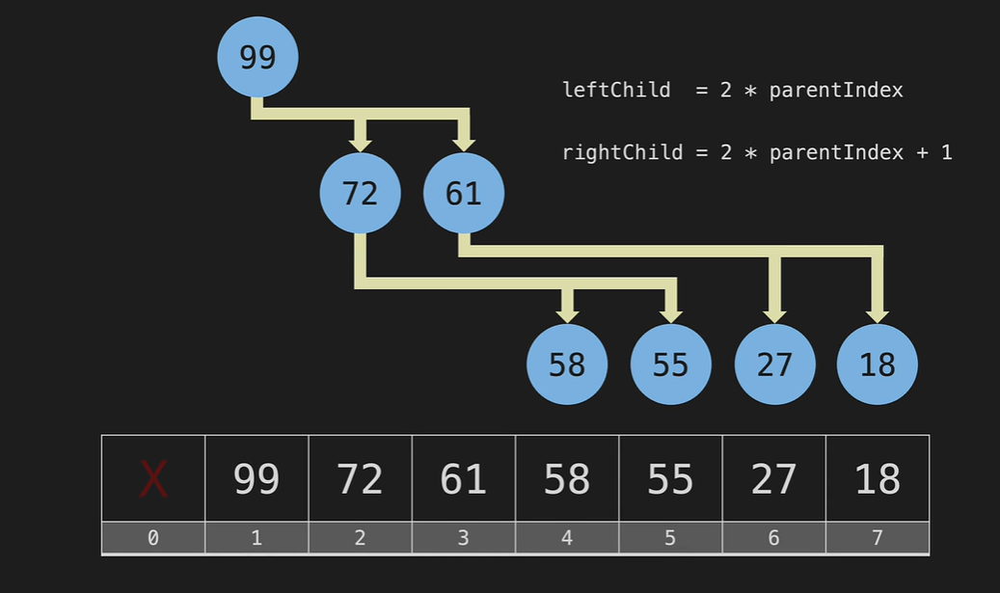

# Heap and Priority Queue Notes

## 用途
- logn时间 - 插入一个元素
- logn时间 - poll()
- O(1)时间 - min(if min heap）or max(if max heap), peak()

## 特性
- heap是一个二叉树，而且是从上到下，从左到右依次添加node的二叉树，给你一个固定数量的点，你就能知道它长什么样 - 是一颗complete tree;
- 可以有重复的点
- could have duplicates;
- min heap (区分于BST)
  - parent node val < subtree val
  - 同一层左右节点的值没有什么关系
- max heap (区分于BST)
  - parent node val 《subtree val
  - 同一层左右节点的值没有什么关系
- 高度是logn
- 可以用数组来存， 0 index 可以用来存放有多少个数
  - leftchild index: parentIdx * 2
  - rightchild index: parentIdx * 2 + 1
  - parent index: childIdx /2




## operation - min heap
- Insert - min heap
  - first insert to the bottom level, following order from left to right;
  - second sift up if its value is smaller than its parent
  - at most sift up for logn times
  - min is the parent node's value

```java
// index 0 to save length, element starts from index 1
import java.util.ArrayList;
import java.util.List;

public class Heap {
    private List<Integer> heap;

    public Heap() {
        this.heap = new ArrayList<>();
        this.heap.add(0);
    }

    public List<Integer> getHeap() {
        return new ArrayList<>(heap);
    }

    private int leftChild(int index) {
        return 2 * index;
    }

    private int rightChild(int index) {
        return 2 * index + 1;
    }

    private int parent(int index) {
        return index/2;
    }

     public int get(int index) {
        if (index <= 0 || index > heap.get(0)) {
            throw new IndexOutOfBoundsException("Index out of range");
        }
        return heap.get(index);
    }

    public int size() {
        return heap.get(0);
    }


    private void swap(int index1, int index2) {
        int temp = heap.get(index1);
        heap.set(index1, heap.get(index2));
        heap.set(index2, temp);
    }

    public void insert(int value) {
        heap.add(value);
        heap.set(0, heap.get(0) + 1); // Update the length stored at index 0
        int current = heap.size() - 1;

        while (current >1 && heap.get(current) > heap.get(parent(current))) {
            swap(current, parent(current));
            current = parent(current);
        }
    }

    
   

}
```
- delete/ poll - 删掉最小值 (顶点node)
  - 用bottom left most left的值去覆盖掉min node的值
  - bottom left 变成顶点，然后在sipt down, 每次和下一层最小的值那边交换
- delete 任意点
  - 没有重复
  - 有可能sipt down 或者sipt up

## Use priority Queue to implement heap
- minHeap

```java
public class MinHeapExample {
    public static void main(String[] args) {
        // Create a PriorityQueue to implement a min-heap
        PriorityQueue<Integer> minHeap = new PriorityQueue<>();

        // Add elements to the min-heap
        minHeap.add(5);
        minHeap.add(3);
        minHeap.add(8);
        minHeap.add(1);

        // Print and remove elements from the min-heap
        while (!minHeap.isEmpty()) {
            System.out.println(minHeap.poll()); // Polling elements in ascending order
        }
    }
}
```

- maxHeap

```java
public class MaxHeapExample {
    public static void main(String[] args) {
        // Create a PriorityQueue to implement a max-heap
        PriorityQueue<Integer> maxHeap = new PriorityQueue<>((a, b) -> b - a);

        // Add elements to the max-heap
        maxHeap.add(5);
        maxHeap.add(3);
        maxHeap.add(8);
        maxHeap.add(1);

        // Print and remove elements from the max-heap
        while (!maxHeap.isEmpty()) {
            System.out.println(maxHeap.poll()); // Polling elements in descending order
        }
    }
}
```
- other methods:
  - peek(): retuan largest node for maxHeap and smallest for minHeap without deleting it
  - remove(val): return true or false; 

- time complexity
  - insertion: O(logn)
  - poll: O(logn)
  - peek(): O(1)
  - romove: O(n)

