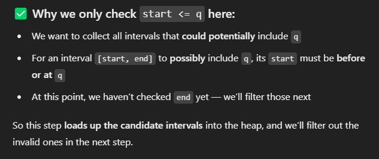
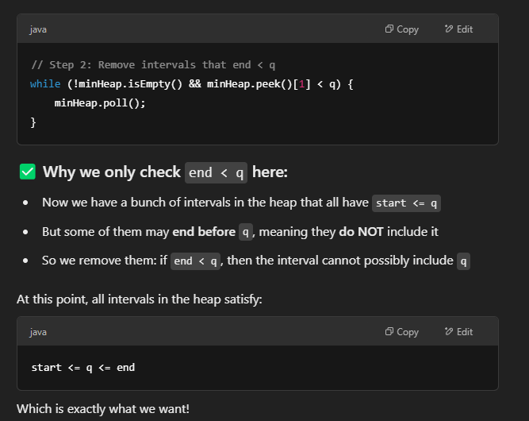

# 1851. Minimum Interval to Include Each Query

Goal: For each query q, find the length of the smallest interval [start, end] such that: start <= q <= end

## Appraoch - sorting + minHeap

### Main idea
Process queries in increasing order and maintain a heap of intervals that could contain the current query.
Remove expired ones.
The top of the heap will be the smallest interval that contains the current query.


### Steps
- Pair each query with its index
    - sort queries for efficiency, but you still want to return results in the original order, so we store both the value and its index.
- Sort queries and intervals. Sorting makes it possible to:
    - Sweep through both lists in a single pass
    - Maintain a growing heap of relevant intervals for each query
- Use a Min-Heap to track valid intervals
    - Heap stores intervals [start, end], and sorts them by interval length (end - start).
    - So the top of the heap is always the smallest valid interval.
- Process each query in sorted order
    - Push intervals that start ≤ query (放入interval)
        - These intervals could cover the quer
        - You only want to process each interval once, so you move i forward and never go back
    - Remove intervals that end < query (filter interval)
        - These intervals end before the query — they no longer matter
        - You clean up the heap so what remains are only intervals that might still contain the query
    - Use top of heap (if any) as result
        - if minHeap is empty, then no valid interval, use -1


```java
class Solution {
    public int[] minInterval(int[][] intervals, int[] queries) {
        int N = queries.length;
        int[] res = new int[N];
        
        // 1. Pair each query with its index
        int[][] queryPairs = new int[N][2];
        for (int i = 0; i < N; i++) {
            queryPairs[i] = new int[] {queries[i], i};
        }

        // 2. Sort queries and intervals
        Arrays.sort(queryPairs, (a,b) -> a[0]-b[0]); // sort queries by value
        Arrays.sort(intervals, (a,b)->a[0]-b[0]); // sort intervals by start time
        
        // 3. Use a Min-Heap to track valid intervals
        int i = 0;
        PriorityQueue<int[]> minHeap = new PriorityQueue<>((a,b)->(a[1] - a[0]) - (b[1] - b[0]));
        
        // 4. Process each query in sorted order
        for (int[] query: queryPairs) {
            int num = query[0];
            int idx = query[1];

            // 4.1 push all intervals starting <= num, whether they end before or after num
            while (i < intervals.length && intervals[i][0] <= num) {
                minHeap.offer(intervals[i]);
                i++;
            }

            // 4.2 Remove intervals that end < num (no longer valid)
            while (!minHeap.isEmpty() && minHeap.peek()[1] < num) {
                minHeap.poll();
            }

            // 4.3 If any valid interval remains, it's the smallest one
            res[idx] = !minHeap.isEmpty()? minHeap.peek()[1] - minHeap.peek()[0] +1: -1;
           
        }
        return res;        
    }
}
```

### Some questions about implementation



当query  = 3, 我们同时check interval start <= 3 && 3 <= interval end, 我们就会skip [2,25], 导致query 22找不到valid interval, 所以这里我们只care start, 把有可能valid的放入minheap, 下一步我们再筛选valid
- intervals [[2,3], [2,5], [2,25], [7,10]];
- queries [3,5,22,26]



- intervals = [[1,8],[2,3],[2,5],[20,25]], 
- queries = [2,5,19,22]
- query = 5, minHeap include [1,8],[2,3],[2,5] with top being [2,3]
- [2,3], 3 < 5, 我们要pull [2,3]
- 如果全部pull 完了说明没有valid , use -1