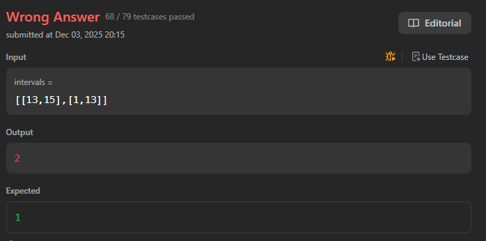
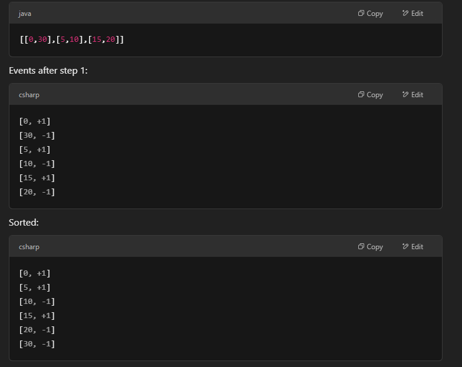

# 253. Meeting Rooms II
这道题对比252 meeting rooms，解法不一样。因为multiple roomting 可能同时进行，252的方法不适用，比如[[2,11],[6,16],[11,16]] 按照252 会得出需要三个房间，实际答案是需要两个，[2,11] [11,16] 可以用同一个，但是252的方法没有考虑到这一点

## Approach 1 - 扫描线 - sort by start time and then end time
- 把会议开始结束时间分别存入一个list, 用-1 和 1代表开始或者结束
- sort之后用count计数即可

```java
class Solution {
    public int minMeetingRooms(int[][] intervals) {
        // 1. 每一个meeting的开始和结束都算不同的event, 把所有event方式list中，开始标注1，结束标注-1
        List<int[]> list = new ArrayList<>();
        for (int[] interval: intervals) {
            list.add(new int[]{interval[0], 1});
            list.add(new int[]{interval[1], -1});
        }
        
        // 2. list中的events按照start time排序，start time 相同的的按end time 排序，因为start time early的会先开始
        Collections.sort(list, (a,b) -> a[0] == b[0]? a[1]-b[1]: a[0]-b[0]);
        
        // 3. 计算在某一个时间点上需要的房间数量
        int count = 0, res = 0;
        for (int[] event: list) {
            count += event[1];
            res = Math.max(res, count);
        }

        return res;
    }
}
```
- Collections.sort(times, (a,b) -> a[0] == b[0]? a[1]-b[1]: a[0]-b[0]); 此处排序一定要这样写 确保当a[0] 相等时 按a[1] 排不然会出错


### example walk through

- Time 0: count = 1 → res = 1
- Time 5: count = 2 → res = 2
- Time 10: count = 1
- Time 15: count = 2
- Time 20: count = 1
- Time 30: count = 0
- Final res = 2 → need 2 rooms

## Approach 2 -sort + minHeap

- sort based on start time: meeting will start based on start time, the one with the earliest start will use the room first. That's why we sort based on start time.
- minHeap: 结束时间最早的meeting 放在最上面，这样下一个meeting可以用它得房间 
    - 如果minHeap是empty, 直接放入meeting
    - 如果不是，我们要比较cur meeting 和结束时间最早的meeting
        - 重叠，把meeting 放入minHeap, 只能多加一个房间
        - 不重叠，这个meeting要用结束时间最早的meeting，把meeting 放入minHeap, 把结束时间最早的meeting poll出来
- minHeap的size就是答案

```java
class Solution {
    public int minMeetingRooms(int[][] intervals) {
        // This ensures that meetings are processed in the order they begin. Sorting is necessary so we can process meetings one by one in chronological order.
        Arrays.sort(intervals, (a, b) -> a[0] == b[0]? a[1]-b[1]: a[0]-b[0]);
        
        // The min-heap keeps track of the earliest ending meetings.
        // It always has the meeting that ends soonest at the top (peek()).
        PriorityQueue<int[]> minHeap = new PriorityQueue<>((a,b) -> a[1]-b[1]);


        // For each new meeting interval, you check if it can reuse an existing room:
            //If its start time interval[0] is after or equal to the earliest ending meeting (meeting[1]), then a room is free.
            // You poll() that meeting — i.e., free the room.
            // Then, you add the current meeting to the heap:
            // This reserves a room (either a reused one or a new one).
        for (int[] interval: intervals) {
            if (!minHeap.isEmpty()) {
                int[] meeting = minHeap.peek();
                if (interval[0] >= meeting[1]) {
                    minHeap.poll();
                }
            }
            minHeap.add(interval);
        }
        
        // the size of the heap reaches is the minimum number of rooms required.
        return minHeap.size();
    }
}

// 另一种写法：
class Solution {
    public int minMeetingRooms(int[][] intervals) {
        Arrays.sort(intervals, (a, b) -> a[0] == b[0]? a[1]-b[1]: a[0]-b[0]);
        PriorityQueue<int[]> minHeap = new PriorityQueue<>((a,b) -> a[1]-b[1]);
        minHeap.offer(intervals[0]);

        for (int i = 1; i < intervals.length; i++) {
            int[] meeting = minHeap.peek();
            if (intervals[i][0] >= meeting[1]) {
                 minHeap.poll();
            }
            minHeap.add(intervals[i]);
        }
        return minHeap.size();
    }
}
```