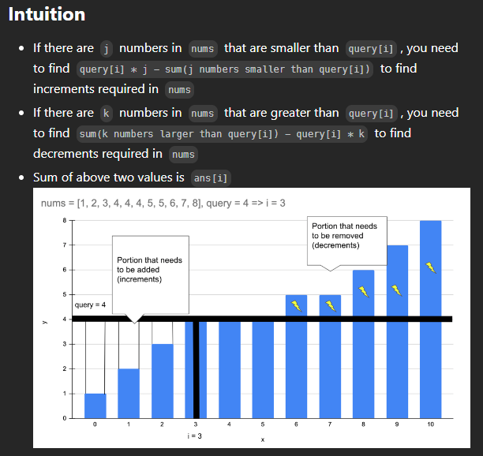
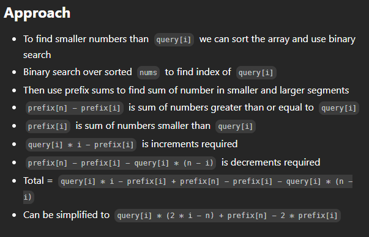

# 2602. Minimum Operations to Make All Array Elements Equal





```java
public class Solution {
    public List<Long> minOperations(int[] nums, int[] queries) {
        Arrays.sort(nums);
        List<Long> ans = new ArrayList<>();
        int n = nums.length;
        
        // Create prefix sum array
        long[] prefix = new long[n + 1];
        for (int i = 1; i <= n; i++) {
            prefix[i] = prefix[i - 1] + nums[i - 1];
        }
        
        // Process each query
        for (int x : queries) {
            int i = Arrays.binarySearch(nums, x);
            if (i < 0) {
                i = -(i + 1);  // convert negative index to insertion point
            }
            
            // Calculate the number of operations needed
            long operations = 1L * x * (2 * i - n) + prefix[n] - 2 * prefix[i];
            ans.add(operations);
        }
        
        return ans;
    }
}
```
- Time complexity: O((n + m) * log(n))

- Space complexity: O(n)