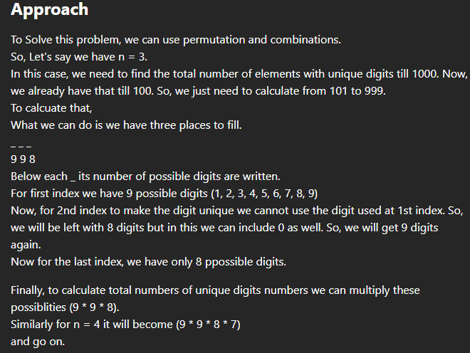
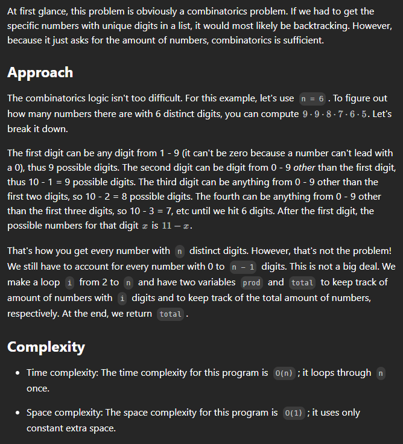
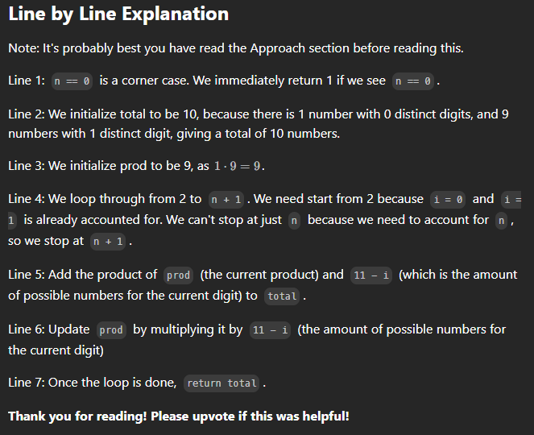

# 357. Count Numbers with Unique Digits



## approach 1

```java
class Solution {
    int[] dp = new int[9];
    public Solution() {
        dp[0] = 1;
        dp[1] = 10;
        dp[2] = 91;
        for(int i=3; i<9; i++) {
            int count = 9;
            int ans = 9;
            for(int j=1; j<i; j++) {
                ans = ans * count;
                count--;
            }
            dp[i] = dp[i - 1] + ans;
        }
    }
    public int countNumbersWithUniqueDigits(int n) {
        return dp[n];
    }
}
```

## approach 2




```java
class Solution {
    public int countNumbersWithUniqueDigits(int n) {
        if (n == 0) {
            return 1;
        }
        int total = 10;
        int prod = 9;
        for (int i = 2; i < n + 1; i++) {
            total += prod * (11 - i);
            prod *= 11 - i;
        }
        return total;
    }
}
```

