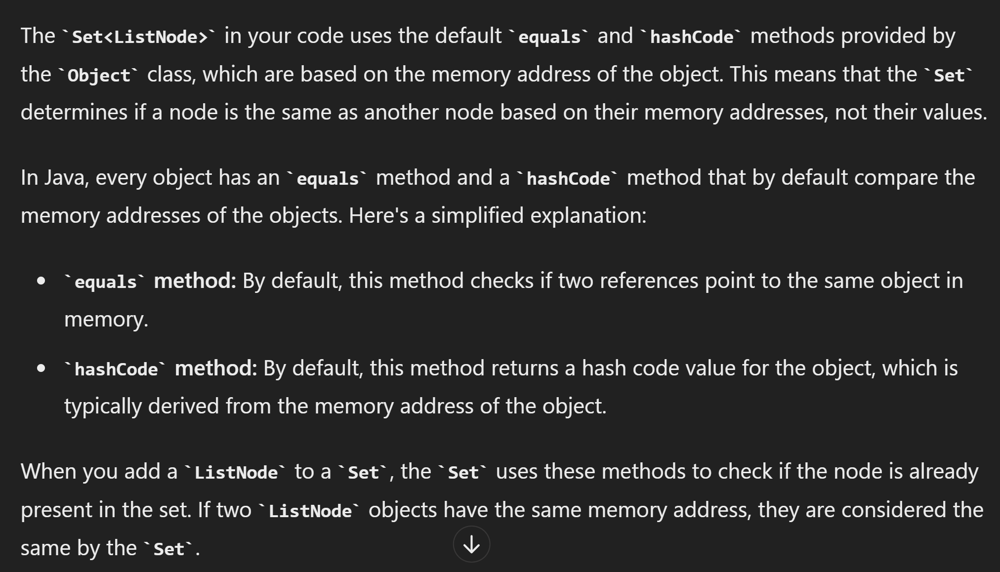

# 141. Linked List Cycle

## Approach 1


```java
/**
 * Definition for singly-linked list.
 * class ListNode {
 *     int val;
 *     ListNode next;
 *     ListNode(int x) {
 *         val = x;
 *         next = null;
 *     }
 * }
 */
public class Solution {
    public boolean hasCycle(ListNode head) {
        if (head == null) {
            return false;
        }

        Set<ListNode> visited = new HashSet<>();

        while (head != null) {
            if (!visited.add(head)) {
                return true;
            }
            head = head.next;
        }
        return false;
    }
}
```


## Approach 2 - two pointers


```java
public class Solution {
    public boolean hasCycle(ListNode head) {
        if (head == null) {
            return false;
        }

        ListNode slow = head, fast = head.next;
        while (slow != fast) {
            if (fast == null || fast.next == null) {
                return false;
            }
            slow = slow.next;
            fast = fast.next.next;
        }
        return true;
    }
}
```