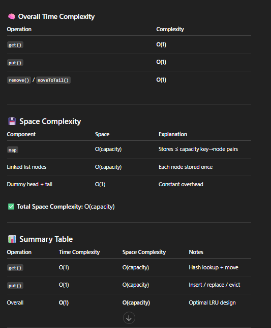

# 146. LRU Cache

## Appraoch 1: HashMap + double-linked linkedList

这道题就是说需要用Hashmap去存key value pair, 同时我们要保证如果超过HashMap 的capacity, 我们要删掉最老的操作，保留最近的操作
- 存储用HashMap实现，最新最老用linkedList实现
- Node 必须有key and value, 因为之后put时有可能需要从 map中删除Node, 需要知道key
- 我们有head and tail nodes, 最近用过的node(get or put)要移动到tail前面一个，head.next是最老的node

### 写法一
More Helper functions, making the code easy to understand

```java
class Node {
    int key;
    int val;
    Node prev;
    Node next;

    public Node(int key, int val) {
        this.key = key;
        this.val = val;
    }
}

class LRUCache {
    Node head;
    Node tail;
    Map<Integer, Node> map;
    int capacity;

    public LRUCache(int capacity) {
        this.capacity = capacity;
        map = new HashMap<>();
        head = new Node(-1, -1);
        tail = new Node(-1, -1);
        head.next = tail;
        tail.prev = head;
    }
    
    public int get(int key) {
        if (!map.containsKey(key)) return -1;
        Node node = map.get(key);
        removeNode(node);
        moveToTail(node);
        return node.val;
    }
    
    public void put(int key, int value) {
        if (map.containsKey(key)) {
            Node exist = map.get(key);
            exist.val = value;
            removeNode(exist);
            moveToTail(exist);
            return;
        }

        if (map.size() == capacity) {
            Node remove = head.next; //注意这里必须要用variable存储remove，不然会出错
            removeNode(remove);
            map.remove(remove.key);
        }

        Node insert = new Node(key, value);
        map.put(key, insert);
        moveToTail(insert);
    }

    private void removeNode(Node cur) {
        cur.prev.next = cur.next;
        cur.next.prev = cur.prev;
    }

    private void moveToTail(Node cur) {
        tail.prev.next = cur;
        cur.prev = tail.prev;
        cur.next = tail;
        tail.prev = cur;
    }
}
```

### 写法二
```java
class Node {
    int key;
    int val;
    Node prev;
    Node next;

    public Node(int key, int val){
        this.key = key;
        this.val = val;
    }
}

class LRUCache {
    HashMap<Integer, Node> map;
    Node head;
    Node tail;
    int capacity;


    public LRUCache(int capacity) {
        this.map = new HashMap<>();
        this.capacity = capacity;
        this.head = new Node(-1, -1);
        this.tail = new Node(-1, -1);
        head.next = tail;
        tail.prev = head;

        
    }
    
    public int get(int key) {
        if (!map.containsKey(key)) {
            return -1;
        }
        Node cur = map.get(key);
        cur.prev.next = cur.next;
        cur.next.prev = cur.prev;
        moveToTail(cur);
        return cur.val;
        
    }
    
    public void put(int key, int value) {
        // case 1: key 已经存在，update val + move to tail
        if (map.containsKey(key)) {
            Node existNode = map.get(key);
            existNode.val = value;
            get(key); // smart way to remove old value
            return;
        }

        // case 2: key 不存在， 要先判断是否
        if (map.size() == capacity) {
            Node removeNode = head.next;
            map.remove(removeNode.key);
            head.next = head.next.next;
            head.next.prev = head;
        }
        Node insert = new Node(key, value);
        map.put(key, insert);
        moveToTail(insert);
        
    }

    public void moveToTail(Node cur) {
        cur.next = tail;
        cur.prev = tail.prev;
        tail.prev.next = cur;
        tail.prev = cur;
    }
}

/**
 * Your LRUCache object will be instantiated and called as such:
 * LRUCache obj = new LRUCache(capacity);
 * int param_1 = obj.get(key);
 * obj.put(key,value);
 */
```

