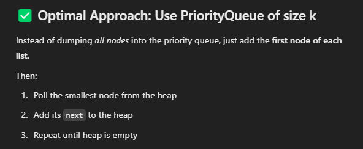

# 23. Merge k sorted Lists




```java
class Solution {
    public ListNode mergeKLists(ListNode[] lists) {
        if (lists == null || lists.length == 0) return null;
        
        PriorityQueue<ListNode> minHeap = new PriorityQueue<>((a,b) -> (a.val - b.val));
        for (ListNode node: lists) {
            if (node != null) minHeap.add(node);
        }
        
        if (minHeap.size() == 0) return null;

        ListNode dummy = new ListNode(-1);
        ListNode cur = dummy;
        while (!minHeap.isEmpty()) {
            ListNode node = minHeap.poll();
            cur.next = node; 
            cur = node;
            if (node.next!= null) minHeap.add(node.next);
        }

        return dummy.next;
    }
}

```