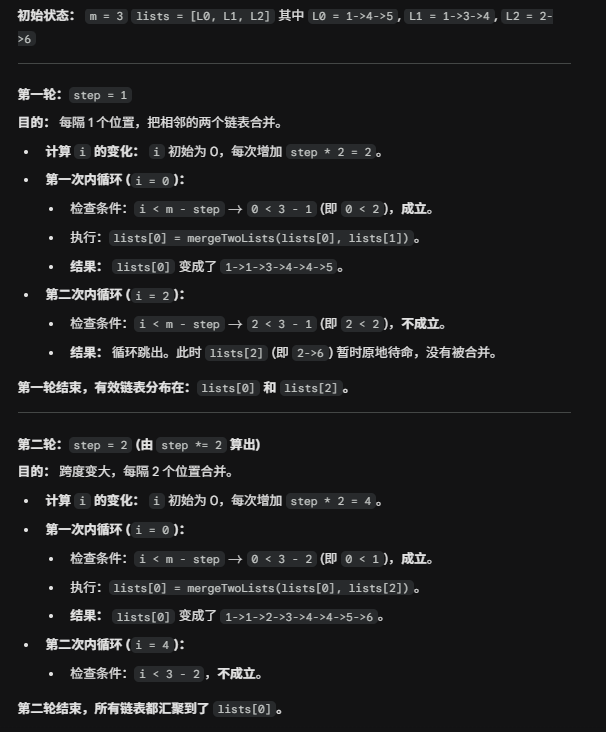

# 23. Merge k sorted Lists

## Approach 1 - PriorityQueue (非常好理解，简单的解法)

1. 最小堆：遍历list, 把每一个链表的非空头节点放入最小堆
2. 合并链表：
    - dummy 和 cur 指针指向dummy, 最后只需返回dummy.next
    - 从最小堆中去除top节点（val最小），把非空的top.next放入堆中
    - 把top节点放入merge的链表中，cur.next = top, cur = cur.next
3. 时空分析
    - time: O(nlogm), n = 所有nodes数量，m = 总共有几个链表
    - space: O(m);

```java
class Solution {
    public ListNode mergeKLists(ListNode[] lists) {
        PriorityQueue<ListNode> minHeap = new PriorityQueue<>((a,b) -> (a.val-b.val));

        for (ListNode node: lists) {
            if (node != null) minHeap.offer(node);
        }

        ListNode dummy = new ListNode(-1);
        ListNode cur = dummy;
        while (!minHeap.isEmpty()) {
            ListNode node = minHeap.poll();
            if (node.next != null) {
                minHeap.offer(node.next);
            }

            cur.next = node;
            cur = cur.next;
        }

        return dummy.next;
    }
}
```

## Approach 2 - 最优解
进一步优化空间，从O(m) -> O(1), 时间仍然是 O(nlogm)

step： 1， 2，4， 8...
    - 合并是把右边的合并到左边，step帮助我们找到需要合并的右边，
        - [a, b, c, d, e, f] 
        - i+1 [ab, b, cd, d, ef, f] 
        - i+2 [abcd, b, cd, d, ef, f]
        - i+4 [abcdef, b, cd, d, ef, f]
        - return list[0]
 
找到每一个左边起点：
    - 内循环是要找到每一个左边的起点，即a, c, e for round 1, ab, cd, ef for round 2, abcd, ef for round 3,
        - i = step * 2 是你要跳过被合并的右边找到下一个左边
```java
class Solution {
    public ListNode mergeKLists(ListNode[] lists) {
        int m = lists.length;
        if (m == 0) {
            return null;
        }

        // 表示需要合并的数字之间相邻距离 i & i+step合并， 0 & 1， 0 & 2， 0 & 4合并，所以要乘以2
        for (int step = 1; step < m; step *= 2) { 
            // i 是每一组合并中左边那个链表的下标，所以 i 每次增加的步长必须是当前间隔的两倍，即 step * 2
                // 当 step = 1 时，i 是索引 0, 2, 4, 6...分别要和索引1，3，5，7合并
                // 当 step = 2 时，i 是 0, 4, 分别要和2，6合并
            // 我们要合并的是 lists[i] 和 lists[i + step]。为了保证 i + step 不会超出数组的最大下标（即 m-1），必须满足
                // i + step < m => i < m-step
            for (int i = 0; i < m - step; i += step * 2) {
                lists[i] = mergeTwoLists(lists[i], lists[i + step]);
            }
        }
        return lists[0];
    }

    // leetocde 21. 合并两个有序链表
    private ListNode mergeTwoLists(ListNode list1, ListNode list2) {
        ListNode dummy = new ListNode(); // 用哨兵节点简化代码逻辑
        ListNode cur = dummy; // cur 指向新链表的末尾
        while (list1 != null && list2 != null) {
            if (list1.val < list2.val) {
                cur.next = list1; // 把 list1 加到新链表中
                list1 = list1.next;
            } else { // 注：相等的情况加哪个节点都是可以的
                cur.next = list2; // 把 list2 加到新链表中
                list2 = list2.next;
            }
            cur = cur.next;
        }
        cur.next = list1 != null ? list1 : list2; // 拼接剩余链表
        return dummy.next;
    }
}
```


