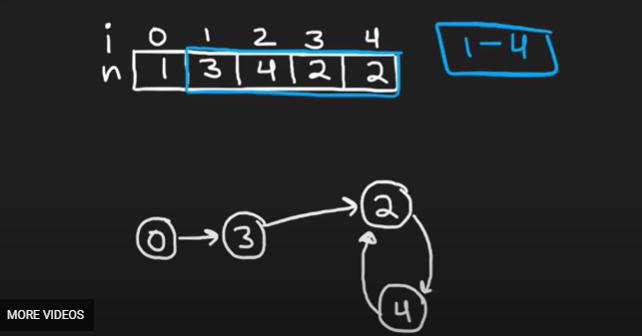

# 287. Find the Duplicate Number

## Approach



- 如果给我们的一个cycled linkedList, 我们怎么找到cycle?
    - slow and fast, slow moves one step and fast moves two steps until they meet
    - set one to head, both move one step until meet again, that point is the cycle
- 这道题需要转换成linkedList without truly doing it. 
    - 每一个num就是指向下一个数字的idx, 所以我们用idx来移动

```java
class Solution {
    public int findDuplicate(int[] nums) {
        int slow = nums[0];
        int fast = nums[0];

        // Step 1: Find the intersection point of the two runners
        do {
            slow = nums[slow];
            fast = nums[nums[fast]];
        } while (slow != fast);

        // Step 2: Find the entrance to the cycle (duplicate number)
        slow = nums[0];
        while (slow != fast) {
            slow = nums[slow];
            fast = nums[fast];
        }

        return slow;
    }
}
```