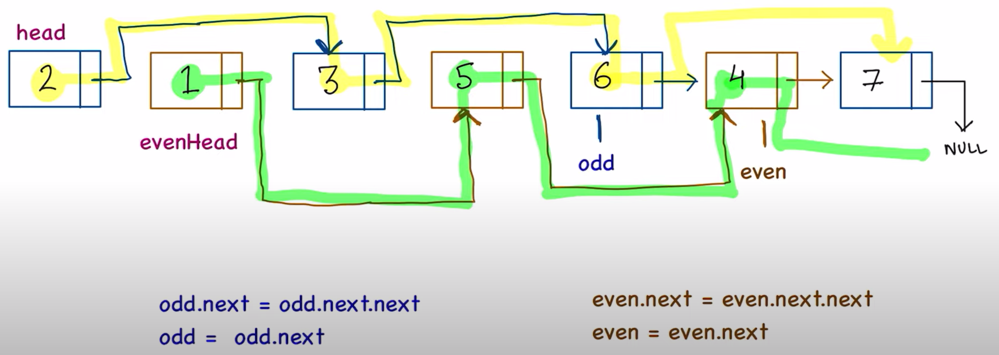

# 328. Odd Even Linked List

[tutorial](https://www.youtube.com/watch?v=WoUAs7R3Ao4)

## Approach 1




- it is a must to have even.next != null. This is for when number of nodes is odd. 

```java
class Solution {
    public ListNode oddEvenList(ListNode head) {
        if (head == null) return null;

        ListNode odd = head;
        ListNode even = head.next;

        // maintain the evenHead;
        ListNode evenHead = even;

        while (even != null && even.next != null) {
            // change pointers for odd list
            odd.next = odd.next.next;
            odd = odd.next;

            // change pointers for even list
            even.next = even.next.next;
            even = even.next;
        }
        
        // assign even list at the end of odd list
        odd.next = evenHead;
        
        return head;
    }
}
```

- time complexity: O(n)
  - The algorithm traverses the entire linked list once. Since it only iterates through the list once, the time complexity for this part is O(n), where n is the number of nodes in the linked list.
  - Inside the loop, the operations involving changing pointers for both odd and even lists are constant time operations, as they involve simple pointer assignments and node access. These operations do not depend on the size of the input.
  - Therefore, the overall time complexity of the algorithm is O(n), where n is the number of nodes in the linked list.

- Space Complexity:
  - The algorithm uses a constant amount of extra space, regardless of the input size. It only uses a few extra pointers (odd, even, evenHead) to keep track of the nodes, and these pointers do not scale with the size of the input.
  - Therefore, the space complexity of the algorithm is O(1), constant space complexity.

- In summary, the given solution has a time complexity of O(n) and a space complexity of O(1).