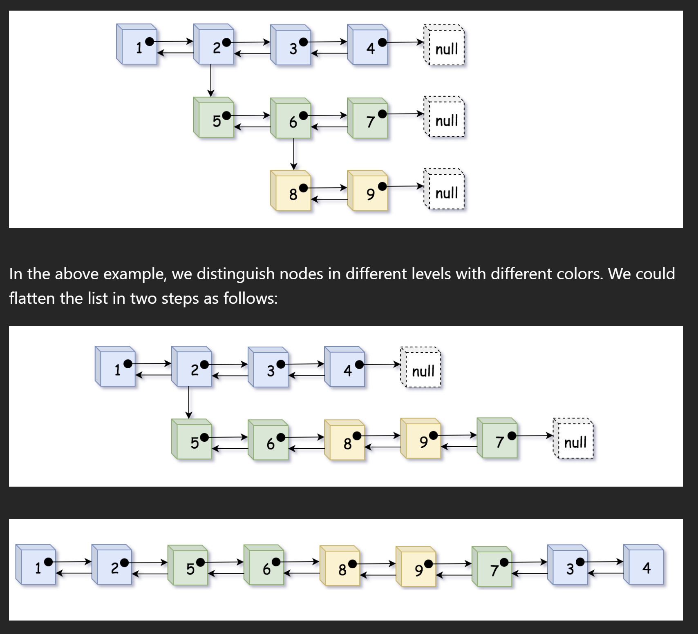
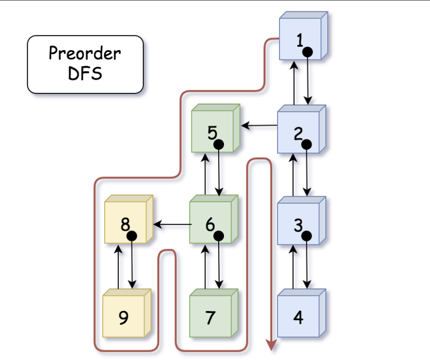

# 430. Flatten a Multilevel Doubly Linked List

## Approach 1 - DFS
- time: O(N), 每个节点被访问一次
- space: O(N)



- Actually, if we turn the above list in 90 degrees around the clock, then suddenly a binary tree appear in front of us. And the flatten operation is basically what we call preorder DFS traversal (Depth-First Search).
- Indeed, as shown in the above graph, we could consider the child pointer as the left pointer in binary tree which points to the left sub-tree (sublist). And similarly, the next pointer can be considered as the right pointer in binary tree. Then if we traverse the tree in preorder DFS, it would generate the same visiting sequence as the flatten operation in our problem.




```java
/*
// Definition for a Node.
class Node {
    public int val;
    public Node prev;
    public Node next;
    public Node child;
};
*/

class Solution {
    public Node flatten(Node head) {
        if (head == null) return head;
        // dummy node to ensure the `prev` pointer is never none
        Node dummy = new Node(-1, null, head, null);

        dfs(dummy, head);

        // detach dummy from head
        dummy.next.prev = null;
        return  dummy.next;
    }

    /* return the tail of the flatten list */
    public Node dfs(Node prev, Node curr) {
        if (curr == null) return prev;
        curr.prev = prev;
        prev.next = curr;

        // the curr.next would be tempered in the recursive function
        Node tempNext = curr.next;

        Node tail = dfs(curr, curr.child);
        curr.child = null;

        return dfs(tail, tempNext);
    }
}

```

- 不用dummy node的写法

- time: O(N), 每个节点被访问一次
- space: O(N)

```java

class Solution {
    public Node flatten(Node head) {
        if (head == null) return null;

        dfs(null, head); // 第一个节点的 prev 是 null
        return head;     // head 自身就是最终结果
    }

    private Node dfs(Node prev, Node curr) {
        if (curr == null) return prev;

        // 特判 prev == null，说明是第一层的第一个节点
        if (prev != null) prev.next = curr;
        curr.prev = prev;

        Node tempNext = curr.next;

        // flatten child
        Node tail = dfs(curr, curr.child);
        curr.child = null;


        // flattern next
        return dfs(tail, tempNext);
    }
}
```


## Approach 2 - DFS Iteration

```java

class Solution {
  public Node flatten(Node head) {
    if (head == null) return head;

    Node dummy = new Node(0, null, head, null);
    Node curr, prev = dummy;

    Deque<Node> stack = new ArrayDeque<>();
    stack.push(head);

    while (!stack.isEmpty()) {
      curr = stack.pop();
      prev.next = curr;
      curr.prev = prev;

      if (curr.next != null) stack.push(curr.next);
      if (curr.child != null) {
        stack.push(curr.child);
        // don't forget to remove all child pointers.
        curr.child = null;
      }
      prev = curr;
    }
    // detach the pseudo node from the result
    dummy.next.prev = null;
    return dummy.next;
  }
}
```