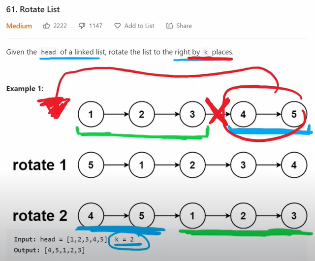
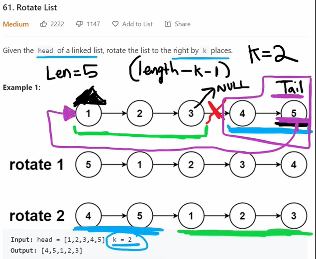

# 61. Rotate List
[Leetcode 61 (medium)][61]

[61]: https://leetcode.com/problems/rotate-list/description/




**Analysis:**
- No need to rotate once a time. We can remove k number of nodes all at once;
- we need to find the node right before kth node from the end. and that need us to move from head length - k - 1 steps. So we need to find length first to know how many steps we need to move;
  - in a real interview, consider using helper function for finding length. This can save us some time to finish the whole questions and also let interviewr know we know how to solve the question if we could not eventually finish.
- what if k >= length? using %, which applies to both k>= length and k < length;
- Dont forget to point head to the new first node. 

**Approach:**
- two pointers; pre targets the node right before the kth node for the end; cur needs to be at the last node;
- find the length (could use helper function here);
- find the steps for pre (length - k -1) to move to the target. Using % on k.
- connect and break; return head.

```java
/**
 * Definition for singly-linked list.
 * public class ListNode {
 *     int val;
 *     ListNode next;
 *     ListNode() {}
 *     ListNode(int val) { this.val = val; }
 *     ListNode(int val, ListNode next) { this.val = val; this.next = next; }
 * }
 */

//Lei's method
class Solution {
    public ListNode rotateRight(ListNode head, int k) {
        if (head == null || head.next == null) return head;

        ListNode cur = head;
        ListNode pre = head;
        int length = 1;
       
        while(cur.next != null) {
            length++;
            cur = cur.next;
        } // here consider using a helper function 

        k = k % length; // no matter k > length or k <= length, we could use this
        int step = length - k -1;

        for (int i = 0; i < step; i++) {
            pre = pre.next;
        }

        cur.next = head;
        head = pre.next;
        pre.next = null;

        return head;
    }
}

//jiuzhang's method: two pointers (one go earlier)
class Solution {
    public ListNode rotateRight(ListNode head, int k) {
        if (head == null) return head;

        ListNode dummy = new ListNode(-1, head);
        
        int length = getLength(head);
        k = k % length;

        ListNode ahead = dummy;
        for (int i = 0; i < k; i++) {
            ahead = ahead.next;
        }

        ListNode behind = dummy;
        while (ahead.next != null) {
            ahead = ahead.next;
            behind = behind.next;
        }

        ahead.next = dummy.next;
        dummy.next = behind.next;
        behind.next = null;

        return dummy.next;
    }

    public int getLength(ListNode head) {
        int length = 0;
        while (head != null) {
            length++;
            head = head.next;
        }
        return length;
    }
}
```