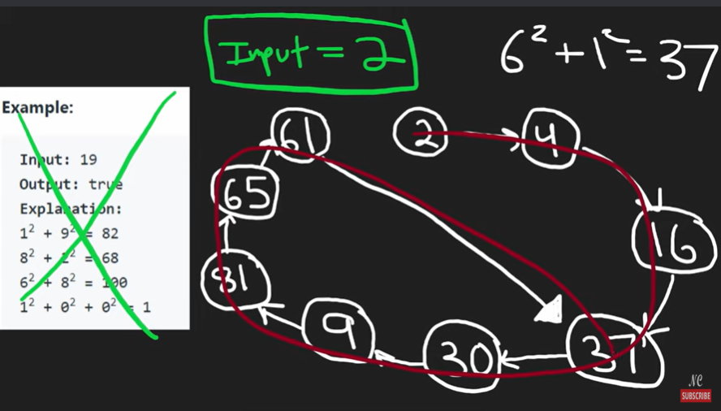

# 202. Happy Number




```java
class Solution {
    public boolean isHappy(int n) {
        HashSet<Integer> set = new HashSet<>();

        while (n !=1 && set.add(n)) {
            n = powerSum(n);
        }

        return n == 1;
    }

    // loop to find the last digit, then res += digit * digit untile n = 0
    private int powerSum(int n) {
        int res = 0;

        while (n != 0) {
            int digit = n % 10;
            int square = digit * digit;
            res += square;
            n = n /10; 
        }
        return res;
    }
}
```