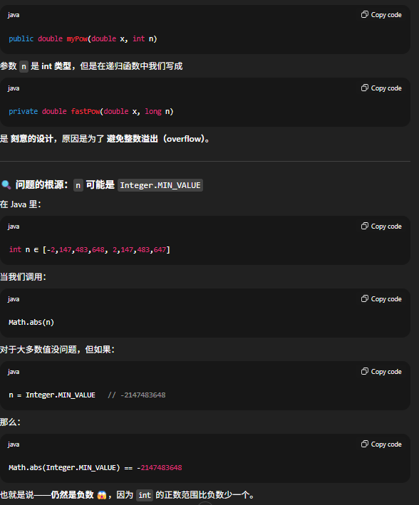

# 50. Pow(x, n)

## Approach 1: 





```java
class Solution {
    public double myPow(double x, int n) {
        if (x == 0 ) return 0;
        if (n == 0) return 1;

        double res = fastPow(x, Math.abs((long)n));
        return n > 0? res: 1/res;
    }

    private double fastPow(double x, long n) {
        if (n == 0) return 1.0;

        double half = fastPow(x, n / 2);
        return (n % 2 == 0)? half * half: half * half * x;
    }
}
```