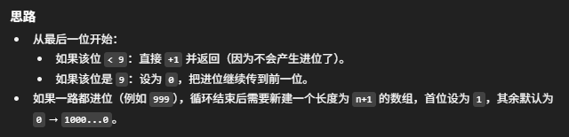

# 66. Plus One

## Approach


```java
class Solution {
    public int[] plusOne(int[] digits) {
        int N = digits.length;
        for (int i = N-1; i >= 0; i--) {
            if (digits[i] < 9) {
                digits[i] = digits[i] + 1;
                return digits;
            }
            digits[i] = 0;
        }

        // for loop 没有return 说明digits全是9
        int[] res = new int[N+1];
        res[0] = 1;
        return res;
    }
}
```