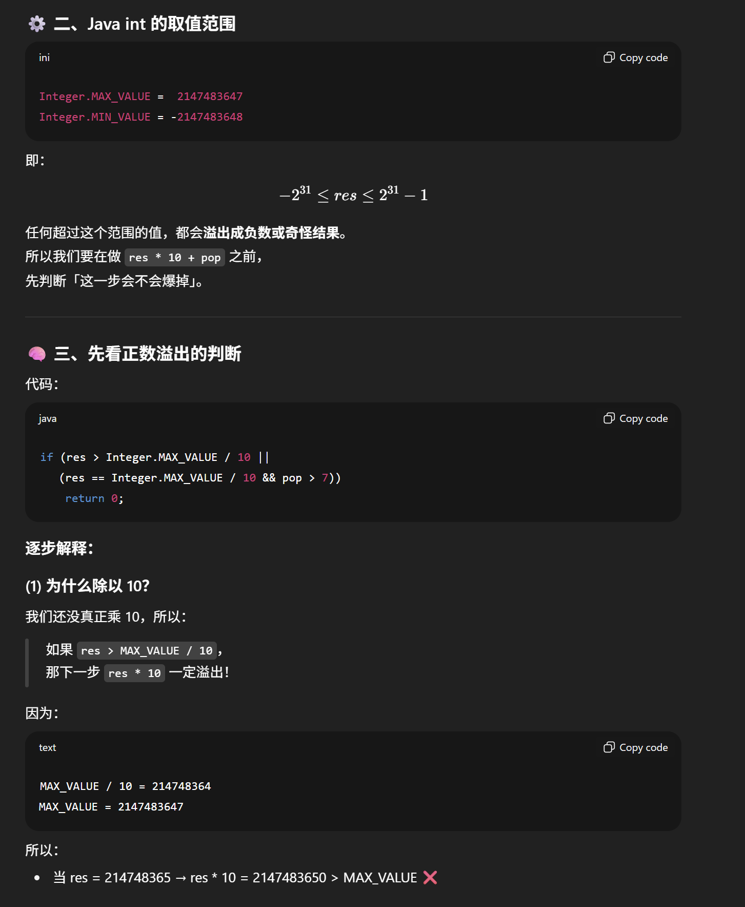
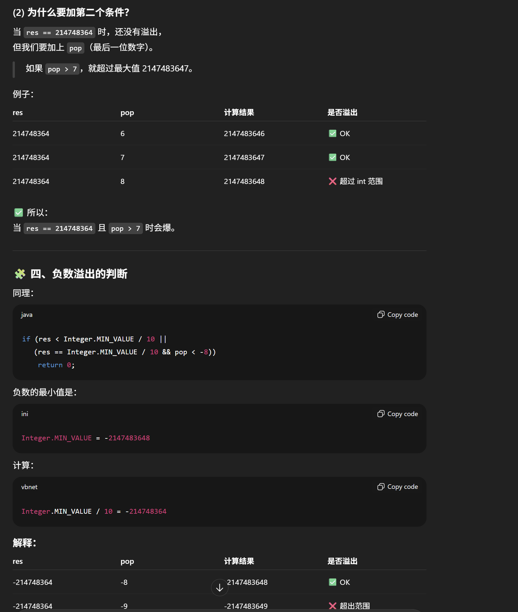

# 7. Reverse Integer

- time: O(logx)
- space: O(1)
- 根据题目要求 这道题不能用long
- x = -123, x % 10 = -2, x / 10 = -12





```java
class Solution {
    public int reverse(int x) {
        int res = 0;

        while (x != 0) {
            int pop = x % 10;
            x = x / 10;

            // overflow conditions
            if (res > Integer.MAX_VALUE / 10 || (
                res == Integer.MAX_VALUE && pop > 7
            )) return 0;
            if (res < Integer.MIN_VALUE / 10 || (
                res == Integer.MIN_VALUE && pop < -8
            )) return 0;

            res = res * 10 + pop;
        }

        return res;
    }
}
```

