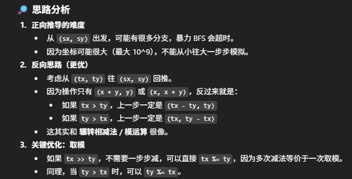

# 780. Reaching Points



- time: O(log(max(tx, ty)))
- space: O(1);


```java
class Solution {
   public boolean reachingPoints(int sx, int sy, int tx, int ty) {
        if (sx == tx && sy == ty) return true;
        if (sx > tx && sy > ty) return false;

        while (tx > sx && ty > sy)
            if (ty > tx) ty %= tx; 
            else tx %= ty;
        
        return sx == tx && sy <= ty && (ty - sy) % tx == 0 ||
                sy == ty && sx <= tx && (tx - sx) % ty == 0;
    }
}
```