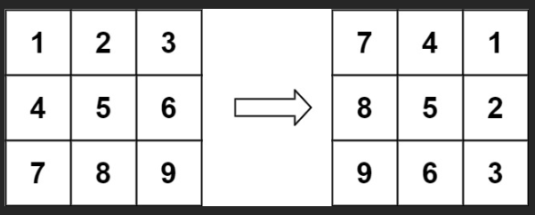
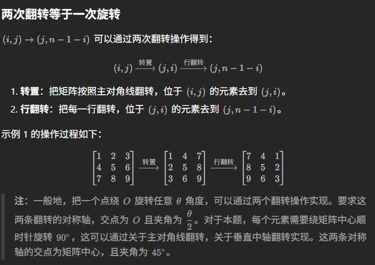

# 48. Rotate Image

## 题目
把一个matrix顺时针转90度，in place 操作


## Approach 1

### 思路
观察原来的和改变的两个matrix
- 竖着看，第一行变成第一列，第二行变成第二列，得出结论：(i, j) -> (j, ?)
- 横着看，第一行变成最后一列，第二行变成倒数第二列，得出结论：(i, j) -> (j, n-i-1)
- 我们可以先转置再反转，正好符合：每一个数字绕中心旋转90度，可以通过两次翻转实现，两次翻转的轴，交点为O，且夹角为90/2，正好是主对角线和中轴



### 实现
1. 转置：把主对角线下面的元素和对称位置的元素交换 maxtrix[i][j] -> maxtrix[j][i]
2. 翻转：把一行翻转，maxtrix[j][i] -> matrix[j][n-1-j]

```java
class Solution {
    public void rotate(int[][] matrix) {
        int n = matrix.length;

        // 1. 转置对角线下部分
        for (int i = 0; i < n; i++) {
            for (int j = 0; j < i; j++) {
                int temp = matrix[i][j];
                matrix[i][j] = matrix[j][i];
                matrix[j][i] = temp;
            }
        }

        // 2. 翻转
        for (int[] row: matrix) {
            for (int j = 0; j < n/2; j++) {
                int temp = row[j];
                row[j] = row[n-1-j];
                row[n-1-j] = temp;
            }
        }
    }
}

```

- time: O(N)
- space: O(1)

另一种写法需要先转置对角线上部分，这样接下来就可以直接翻转，如果先转置对角线下部分，第一行就不能直接翻转

```java
class Solution {
    public void rotate(int[][] matrix) {
        int n = matrix.length;

        for (int i = 0; i < n; i++) {
            // 转置：对角线上方
            for (int j = i+1; j < n; j++) {
                int temp = matrix[i][j];
                matrix[i][j] = matrix[j][i];
                matrix[j][i] = temp;
            }

            // 翻转
            int[] row = matrix[i];
            for (int j = 0; j < n/2; j++) {
                int temp = row[j];
                row[j] = row[n-1-j];
                row[n-1-j] = temp;
            }
        }
    }
}

```