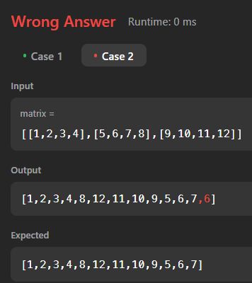

# 54. Spiral Matrix
- Method:
    - 确定边界，开始走， 走完一圈再缩小边界

- Why do we need "res.size() < m * n" in each for loop?
    - If the matrix has been fully traversed (i.e., res.size() == m * n), there’s no need to continue. Without the condition, the loops might continue and try to add elements outside the valid matrix range, resulting in duplicates or errors.
    - Once all elements are added, any further iterations in the for loops would be redundant. The condition prevents unnecessary computation.

- The condition res.size() < m * n is used instead of res.size() <= m * n because the result list res will already contain all the elements of the matrix once its size equals 
m×n. Adding another element after that would result in an extra, invalid addition.


```java
class Solution {
    public List<Integer> spiralOrder(int[][] matrix) {
        List<Integer> res = new ArrayList<>();
        int n = matrix.length, m = matrix[0].length;
        int top = 0, bottom = n - 1;
        int left = 0, right = m-1;

        while (res.size() < m * n) { // 相当于 for (int k = 0; k < m*n; k++) {...}
            for (int j = left; j <= right && res.size() < m * n; j++) {
                res.add(matrix[top][j]);
            }

            for (int i = top+1; i <= bottom && res.size() < m * n; i++) {
                res.add(matrix[i][right]);
            }

            for (int j = right-1; j >= left && res.size() < m * n; j--) {
                res.add(matrix[bottom][j]);
            }

            for (int i = bottom-1; i >= top+1 && res.size() < m * n; i--) {
                res.add(matrix[i][left]);
            }

            top++; bottom--; left++; right--;
        }
        return res;
    }
}
```

- time: O(m * n)
    - Each element is processed once, so the complexity depends on the total number of elements in the matrix
- Space: O(1);