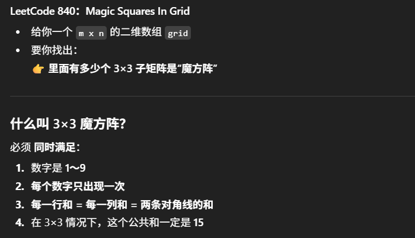
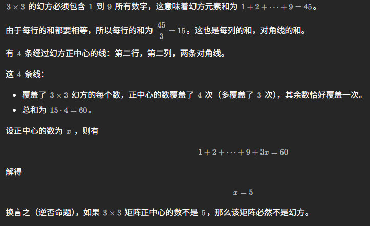

# 840. Magic Squares In Grid




### Idea

https://leetcode.cn/problems/magic-squares-in-grid/solutions/3867033/wu-xu-ji-suan-di-san-xing-lie-de-he-yi-j-djue/

1. 幻方正中心一定是 5， 且每行每列对角线的和应该是15
    

2. 无需计算第三行的和，第三列的和
    - 如果 3×3 矩阵包含 1 到 9 所有整数，且前两行的和都是 15，那么第三行的和为
    - 1+2+⋯+9−15−15=15
    - 同理，如果前两列的和都是 15，那么第三列的和必然是 15。

3. 无需计算对角线的和
    - 如果 3×3 矩阵：
    - 正中心的数是 5
    - 包含 1 到 9 所有整数
    - 前两行的和都是 15
    - 前两列的和都是 15
    - 矩阵对角线的和一定都是 15

4. 时空分析
- time: O(mn)
- space: O(1)

### 方法

1. 遍历grid, 枚举每一个 3×3 子矩阵
2. 对每一个子矩阵，调用 isMagic 判断是否valid，只需检查：
    - 中心 == 5？
    - 前两行
    - 前两列
    - 第三列，第三行，对角线都不用检查（见idea）

#### 写法一（好理解）

```java
class Solution {
    public int numMagicSquaresInside(int[][] grid) {
        int m = grid.length, n = grid[0].length;
        int ans = 0;

        for (int i = 0; i < m - 2; i++) {
            for (int j = 0; j < n - 2; j++) {
                if (isMagic(grid, i, j)) ans++;
            }
        }
        return ans;
    }

    private boolean isMagic(int[][] g, int r, int c) {
        // 1️ 中心必须是 5
        if (g[r + 1][c + 1] != 5) return false;

        // 2️ 数字必须是 1~9 且不重复
        boolean[] seen = new boolean[10];
        for (int i = r; i < r + 3; i++) {
            for (int j = c; j < c + 3; j++) {
                int x = g[i][j];
                if (x < 1 || x > 9 || seen[x]) return false;
                seen[x] = true;
            }
        }

        // 3️ 只检查前两行
        for (int i = 0; i < 2; i++) {
            int sum = g[r + i][c] + g[r + i][c + 1] + g[r + i][c + 2];
            if (sum != 15) return false;
        }

        // 4 只检查前两列
        for (int j = 0; j < 2; j++) {
            int sum = g[r][c + j] + g[r + 1][c + j] + g[r + 2][c + j];
            if (sum != 15) return false;
        }

        return true;
    }
}
```

#### 写法二： mask (不好理解但是是one pass)

```java
class Solution {
    public int numMagicSquaresInside(int[][] grid) {
        int m = grid.length;
        int n = grid[0].length;
        int ans = 0;

        for (int i = 0; i < m - 2; i++) {
            for (int j = 0; j < n - 2; j++) {
                if (grid[i + 1][j + 1] != 5) {
                    continue;
                }

                int mask = 0;
                int[] rSum = new int[3];
                int[] cSum = new int[3];
                for (int r = 0; r < 3; r++) {
                    for (int c = 0; c < 3; c++) {
                        int x = grid[i + r][j + c];
                        mask |= 1 << x;
                        rSum[r] += x;
                        cSum[c] += x;
                    }
                }

                if (mask == (1 << 10) - 2 &&
                    rSum[0] == 15 && rSum[1] == 15 &&
                    cSum[0] == 15 && cSum[1] == 15) {
                    ans++;
                }
            }
        }

        return ans;
    }
}
```