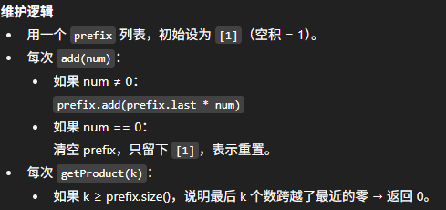

# 1352. Product of the Last K Numbers

## Approach 1 - prefixProduct

- prefix product
    - product[i] 表示前i个数的乘积
    - 组后k个数乘积可以写为 prefix[n-1] / prefix[n-1-k];
        - e.g [3, 1, 2, 5, 4]
        - prefix [1, 3, 3, 6, 30, 120] 
        - k = 1, 120/30 = 4
        - k = 2, 120/6 = 20
    - 如果数组中从来没有零，上面的前缀积方法非常完美, 但遇到零的时候，整个前缀积会被清零，除法也会失效。解决办法是
        - 每次遇到零，就清空前缀积数组，从零开始记录新的前缀积
        - 同时记住零的位置：如果查询的 k 包含了这个零，那么答案就是 0
        
        

```java
class ProductOfNumbers {
    List<Integer> prefixProducts;

    public ProductOfNumbers() {
        prefixProducts = new ArrayList<>();
        prefixProducts.add(1);
    }
    
    public void add(int num) {
        if (num == 0) {
            prefixProducts.clear();
            prefixProducts.add(1);
        } else {
            int last = prefixProducts.get(prefixProducts.size()-1);
            prefixProducts.add(last * num);
        }
    }
    
    public int getProduct(int k) {
        int n = prefixProducts.size();
        if (k >= n) return 0;
        return prefixProducts.get(n-1) / prefixProducts.get(n-1-k);
    }
}
```