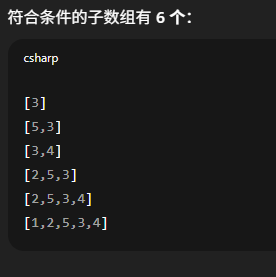
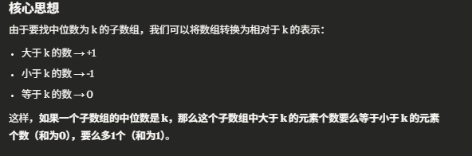
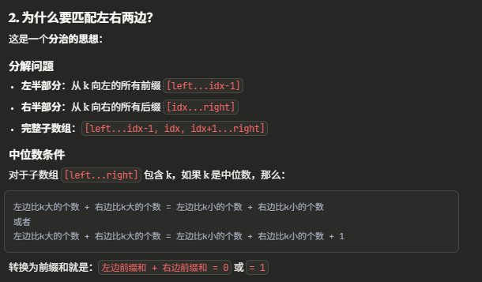

# 2488. Count Subarrays With Median K

## 理解题目

这道题问的是给你一个median k, 有多少子数组符合medin是k
- [1,2,5,3,4], k = 3, 符合条件 (即median为k的子数组)有6个


## Approach


- 做-1和1的转换有利于我们计算出median 左右两边个数相差的情况。这里的前缀和不是用来计算具体数值的和，而是用于判断左边和右边有多少个大于小于k的
- 从 k 的位置向左计算前缀和，记录每个和值出现的次数。注意这里从右往左计算，map.put(0, 1)表示空前缀（即只包含 k 本身的情况）。




```java
class Solution {
    public int countSubarrays(int[] nums, int k) {
        int idx = -1; // idx = 3

        // 1. 找到index of k
        for (int i = 0; i < nums.length; i++) {
            if (nums[i] == k) {
                idx = i;
                break;
            }
        }

        // 2. left prefixSum from idx-1 to 0 position
        HashMap<Integer, Integer> map = new HashMap<>(); 
        int sum = 0;
        map.put(sum, 1); // 空前缀
        
        for (int i = idx-1; i >= 0; i--) { // 一定要倒这来 否则会出错
            sum += nums[i] > k? 1: -1;
            map.put(sum, map.getOrDefault(sum, 0)+1);
        }

        // 3. match with right prefixsum, together should be 0 or 1
        sum = 0;
        int res = 0;
        for (int i = idx; i < nums.length; i++) {
            sum += nums[i] == k? 0: nums[i] > k? 1: -1;
            res += map.getOrDefault(1-sum, 0);
            res += map.getOrDefault(0-sum, 0);
        } 

        return res;
    }
}
```