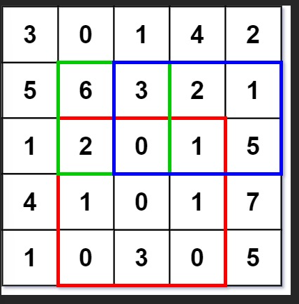
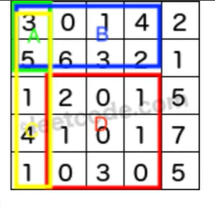
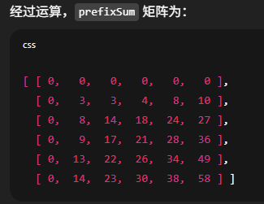

# 304. Range Sum Query 2D - Immutable

## Approach

### 图示




### 思路
其实是一道看起来复杂， 搞懂之后非常简单的题目。构建2D prefixSum，然后用prefixSum去求
- 如何构建2D prefixSum？
    - int[][] prefixSum = new int[rows+1][cols+1]; 比原来的matrix 多一行和多一列
        - prefix[i+1][j+1] 代表的是从matrix(0，0）~ matrix(i, j)的所有格子数之和
    - 上部分 + 左部分 + 自己 - 重复加的对角部分
        - prefixSum[i+1][j+1] = prefixSum[i][j+1] +  prefixSum[i+1][j] + matrix[i][j] - prefixSum[i][j]; 
- 如何求从matrix(row1, col1) ~ matrix(row2, col2) 区域所有格子之和呢？
    - 原理：sumRed = sum全部 - sumBlue - sumYellow + sumGreen (被减去了两次), 所有颜色区域都是从(0, 0)开始
    - 重点： 从matrix(0, 0) ~ matrix(x, y)的所有格子之和 = prefixSum[x+1][y+1];
        - sum全部 (x = row2, y = col2) = prefixSum[row2+1][col2+1];
        - sumBlue(x = row1-1, y = col2) = prefixSum[row1-1+1][col2+1] = prefixSum[row1][col2+1];
        - sumYellow (x = row2, y = col1-1) = prefixSum[row2+1][col1-1+1] = prefixSum[row2+1][col1]
        - sumGreen(x = row1-1, y = col1-1) = prefixSum[row1][col1];

```java
class NumMatrix {
    int[][] prefixSum;

    public NumMatrix(int[][] matrix) {
        int rows = matrix.length, cols = matrix[0].length;
        prefixSum = new int[rows+1][cols+1];

        for (int i = 0; i < rows; i++) {
            for (int j = 0; j < cols; j++) {
                prefixSum[i+1][j+1] = prefixSum[i][j+1] +  prefixSum[i+1][j] + matrix[i][j] - prefixSum[i][j]; 
            }

        }
    }
    
    public int sumRegion(int row1, int col1, int row2, int col2) {
        return prefixSum[row2+1][col2+1] - prefixSum[row1][col2+1] - prefixSum[row2+1][col1] + prefixSum[row1][col1];
    }
}
```