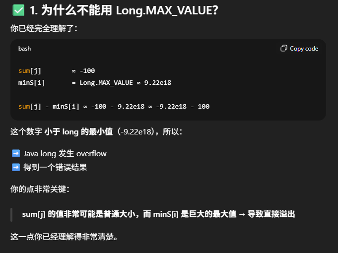
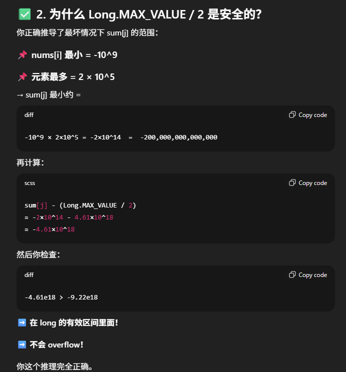

# 3381. Maximum Subarray Sum With Length Divisible by K

## Approach 1 - prefix Sum

### 前置知识
1. int 范围：[-2.1e9, 2.1e9]
2. long 范围： [-9.22e18, 9.22e18]
3. 前缀和：
    - nums[i..j)的和是用 prefixSum[j] - prefixSum[i]
    - [i..j) 的长度 = j - i;
4. j - i n能被 k 整除的条件是 j % k = i % k; 

### 思路
题目求得是所有长度能被k整除的subarray中，返回和最大的那一个的和，转换一下：
    - subarray sum = prefixSum[j] - prefixSum[i]
    - 满足 i < j, j % k = i % k
    - 返回subarray sum满足以上条件最大的一个
        - prefixSum[j] - prefixSum[i] 要尽可能大，则prefixSum[i]就要尽可能小

1. 计算prefixSum 数组
2. 构建 minPrefixSum数组，把j % k, 即j除以k的余数分为k组，即0，1，2，3...k-1（只有可能是这几种即可，不可能 j % k = k）
    - 每一组存的是j % k相等的所有prefix[j]里面最小的值，
    - 比如 k = 2, 3 % 2 = 5 % 2 = 1， prefix[3] = 10， prefixSum[5] = -2, minPrefixSum[1] = -2 not 10
3. 遍历prefixSum 数组
    - 计算 j % k = 
    - 计算 prefixSum[j] - minPrefixSum[i]， 如果小于res，更新res
    - update minPrefixSum[i] = Math.min(minPrefixSum[i], prefixSum[j])
4. 关于溢出： 1 <= k <= nums.length <= 2 * 10^5， -10^9 <= nums[i] <= 10^9
    - prefixSum[j] 可以等于10^14, 超过int范围，prefixSum 只能是long[]
    - Long.MAX_VALUE/2 不能是Long.MAX_VALUE， 因为prefixSum[j] - Long.MAX_VALUE可能会溢出，而prefixSum[j] - Long.MAX_VALUE/2不会





```java
class Solution {
    public long maxSubarraySum(int[] nums, int k) {
        // 1. 构建前缀和
        int n = nums.length;
        long[] prefixSum = new long[n+1]; // 前缀和必须用long 不然会溢出
        for (int i = 0; i < n; i++) prefixSum[i+1] = nums[i] + prefixSum[i];

        // 2. 前缀和 % k 分组
        long[] minPrefixSum = new long[k];
        Arrays.fill(minPrefixSum, Long.MAX_VALUE/2); // 必须/2， 不然会溢出

        // 3. 遍历前缀和，计算最大subarray sum，更新最小前缀和
        long res = Long.MIN_VALUE;
        for (int j = 0; j < prefixSum.length; j++) {
            int i = j % k;
            res = Math.max(res, prefixSum[j] - minPrefixSum[i]);
            minPrefixSum[i] = Math.min(minPrefixSum[i], prefixSum[j]);
        }
        return res;
    }
}

```