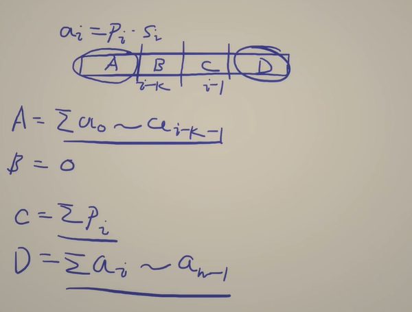

# 3652. Best Time to Buy and Sell Stock using Strategy

[灵神视频讲解](https://leetcode.cn/link/?target=https%3A%2F%2Fwww.bilibili.com%2Fvideo%2FBV1kTYyzwEDD%2F%3Ft%3D29m23s)

## Approach 1 - 两个前缀和 + 枚举窗口 (推荐，好写)



1. 计算每一部分
    - A = sum[i - k]
    - B = 0
    - D = sum[n] - sum[i]
    - C = sumSell[i] - sumSell[i - k / 2]
2. B和C的中点怎么求出来的
    - (i-1+i-k+1) /2 = i - k/2

```java
class Solution {
    public long maxProfit(int[] prices, int[] strategy, int k) {
        int n = prices.length;
        long[] sum = new long[n + 1]; // price * strategy 前缀和
        long[] sumSell = new long[n + 1]; // price 前缀和
        for (int i = 0; i < n; i++) {
            sum[i + 1] = sum[i] + prices[i] * strategy[i];
            sumSell[i + 1] = sumSell[i] + prices[i];
        }

        long ans = sum[n]; // 不修改
       
        // 这里是在枚举窗口，i代表长度为k的区间的右边界（不含)
        // 窗口是 [i-k, i-1] or [i-k, i)
        for (int i = k; i <= n; i++) { 
            long windowSum = sum[i - k] + sum[n] - sum[i] + sumSell[i] - sumSell[i - k / 2];
            ans = Math.max(ans, windowSum);
        }
        return ans;
    }
}
```
- time: O(N)
- space: O(N)

## Approach 2 - Sliding window （推荐，空间更优，最优解, 但是不太好写）
没理解

```java
class Solution {
    public long maxProfit(int[] prices, int[] strategy, int k) {
        long total = 0, maxSum = 0, sum = 0;
        for (int i = 0; i < prices.length; i++) {
            int p = prices[i], s = strategy[i];
            total += p * s; // 不修改时的最大利润

            // 1. 下标为 i 的元素入右半，交易策略从 s 变成 1
            sum += p * (1 - s);

            if (i < k - 1) { // 尚未形成第一个窗口
                // 在下一轮循环中，下标为 i-k/2+1 的元素从右半移到左半，交易策略从 1 变成 0
                if (i >= k / 2 - 1) {
                    sum -= prices[i - k / 2 + 1];
                }
                continue;
            }

            // 2. 更新
            maxSum = Math.max(maxSum, sum); // 修改带来的最大额外利润

            // 3. 出，为下一个窗口做准备
            // 下标为 i-k/2+1 的元素从右半移到左半，交易策略从 1 变成 0，
            // 下标为 i-k+1 的元素从左半离开窗口，交易策略从 0 恢复为 strategy[i-k+1]
            sum -= prices[i - k / 2 + 1] - prices[i - k + 1] * strategy[i - k + 1];
        }

        return total + maxSum;
    }
}
```

- time: O(N)
- space: O(1)
