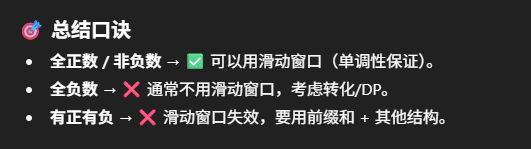

# 862. Shortest Subarray with Sum at Least K

## Similar question
这道题是209的升级版，唯一区别是209给的数组都是整数，而这道题的数组有正有负数, 这一点不同就导致了解法差别很大


## Approach 1 - 最优解: prefixSum + 单调队列
- time: o(n)

```java
class Solution {
    public int shortestSubarray(int[] A, int K) {
        int N = A.length, res = N + 1;

        long[] sum = new long[N + 1]; // 改成 long
        for (int i = 0; i < N; i++) {
            sum[i + 1] = sum[i] + A[i];
        }

        Deque<Integer> q = new ArrayDeque<>();
        for (int i = 0; i < N + 1; i++) {
            while (!q.isEmpty() && sum[q.peekLast()] >= sum[i]) {
                q.pollLast();
            }

            while (!q.isEmpty() && sum[i] - sum[q.peekFirst()] >= K) {
                res = Math.min(res, i - q.pollFirst());
            }

            q.offerLast(i);
        }

        return res <= N ? res : -1;
    }
}
```