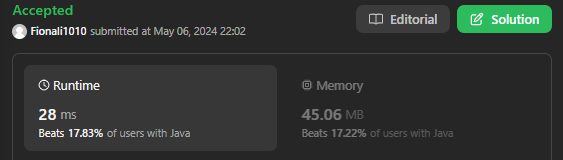
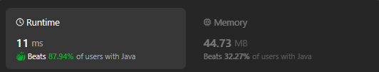

# 1456.Maximum Number of Vowels in a Substring of Given Length

## Approach 1 by Lei
- The time complexity of this solution is O(n), where n is the length of the input string s. This is because the algorithm iterates through the string only once with two pointers left and right, and performs constant-time operations (such as checking if a character is a vowel) for each character.
- The space complexity is O(1), meaning it uses a constant amount of extra space regardless of the input size. This is because the extra space used (variables left, right, max, count, and vowels) does not scale with the size of the input string and remains constant throughout the execution of the algorithm.

Why is it slow?
- Character lookup in a string: When you call vowels.contains(...), the method internally iterates over each character in the string vowels to check if it contains the specified character. This requires checking each character sequentially until a match is found or the end of the string is reached. In contrast, using a boolean array allows for direct indexing based on the character's position in the alphabet, which is more efficient.
- Creating a new string for each character: Calling String.valueOf(s.charAt(i)) creates a new string object for each character in the input string s. This incurs unnecessary overhead, especially since we only need to check if the character is a vowel.
- Redundant checks: Since the vowels are fixed and known in advance, performing a linear search for each character in the string is less efficient than using a data structure that allows for constant-time lookup, such as a boolean array.



```java
class Solution {
    public int maxVowels(String s, int k) {
        int left = 0;
        int right = left + k - 1;
        int max = 0;
        int count = 0;
        String vowels = "aeiou";
        

        for (int i = 0; i < k; i++) {
            if (vowels.contains(String.valueOf(s.charAt(i)))) count++; //
        }

        max = count;

        while (right < s.length()) {
            left++;
            right++;
            if (right < s.length()) {
                if (vowels.contains(String.valueOf(s.charAt(left-1)))) count--;
                if (vowels.contains(String.valueOf(s.charAt(right)))) count++;
                max = Math.max(max, count);
            }
        }
        return max;
    }
}
```

## Approach 2 by Lei - improved version

```java
class Solution {
    public int maxVowels(String s, int k) {
        int left = 0;
        int right = left + k - 1;
        int max = 0;
        int count = 0;

        boolean[] isVowel = new boolean[26];
        isVowel['a'-'a'] = true;
        isVowel['e'-'a'] = true;
        isVowel['i'-'a'] = true;
        isVowel['o'-'a'] = true;
        isVowel['u'-'a'] = true;        

        

        for (int i = 0; i < k; i++) {
            if (isVowel[s.charAt(i) - 'a']) count++;
        }

        max = count;

        while (right < s.length()) {
            left++;
            right++;
            if (right < s.length()) {
                if (isVowel[s.charAt(left-1) - 'a']) count--;
                if (isVowel[s.charAt(right) - 'a']) count++;
                max = Math.max(max, count);
            }
        }
        return max;
    }
}
```