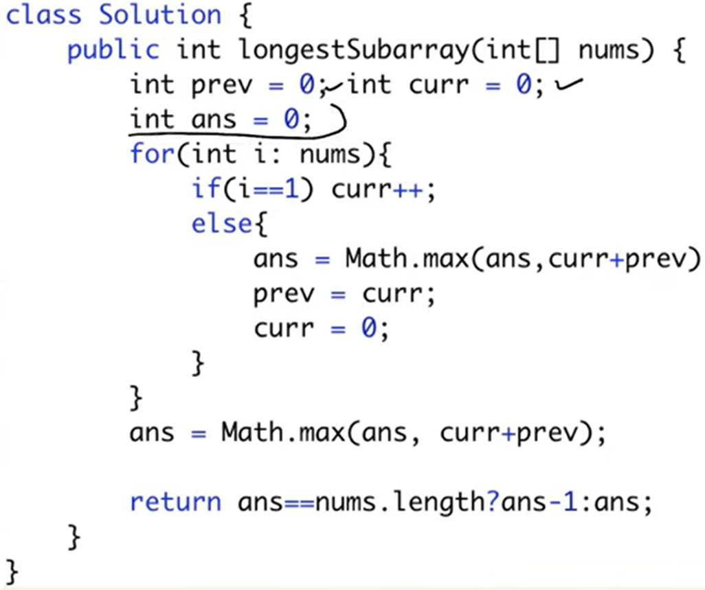
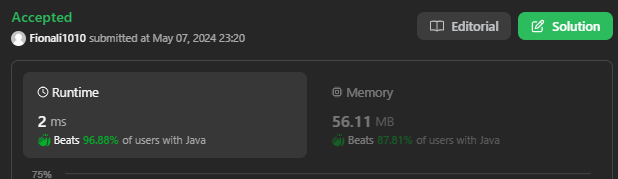
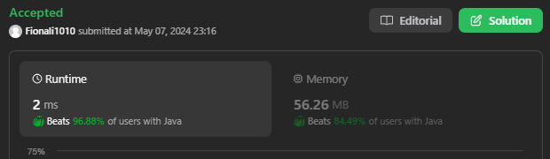

# 1493. Longest Subarray of 1's After Deleteing One Element

## Approach 1 by Lei

- **题目巧妙之处**
  - 这道题的写法非常巧妙
  - 表面上你会以为需要同时关注 **zero 的 count** 和 **one 的 count**
  - 实际上，只关注 **zero count** 就能解决

- **思路分析**
  - 假设数组里全是 1
    - 比如三个 1，不管怎么做，最后 output 一定是 2
    - 因为你必须要删掉一个 element
  - 如果全是 0
    - 直接 return 0
  - 所以看起来你既要关心 zero count，又要关心 one count

- **更巧妙的写法**
  - 只用关心 **zero count**
  - 在 sliding window 里，始终保证 `zero count <= 1`
    - 如果 `zero count > 1`，就 shrink
    - 这样可以保证窗口始终是 **valid**
  - 所谓 **valid**：
    - 当 `zero count <= 1` → 窗口有效
    - 当 `zero count > 1` → 窗口无效，需要 shrink

- **结果计算**
  - 每次窗口 valid 的时候，更新结果
  - 结果不是 `i - left + 1`，而是 **`i - left`**
    - 为什么？
      - 因为无论如何，你都必须 delete 一个 element
      - 所以不能加 1
  - 这样就完美符合题目要求

- **总结**
  - 本题的巧妙之处在于：
    - 用 **zero count** 来决定窗口是否 valid
    - 结果计算时用 `right - left` 而不是 `right - left + 1`
    - 省去了对 one count 的关注
  - 最终实现非常简洁优雅


```java
class Solution {
    public int longestSubarray(int[] nums) {
        int left = 0;
        int zeroCount = 0;
        int res = 0;

       for (int i = 0; i < nums.length; i++) {
            if (nums[i] == 0) {
                zeroCount++;
            }
          
            while (zeroCount > 1) {
                if (nums[left] == 0) {
                    zeroCount--;
                }
                left++;
            }

            res = Math.max(res, i-left);
        }
        return res;
    }
}
```

## Approach 2

[tutorial](https://www.youtube.com/watch?v=jhBrybXSFTs)





- k is for loop iterations
- i is the sum of ones in the leftside of the expected subarray
- j is the sum of ones in the rigtside of the expected subarray
- if j+nums[k] does not increase its value, we can say nums[k] is 0
- thus i+j can a valid subarray
- finally checking n==j if all elements are 1s then answer is n-1 or j-1 since we HAVE to delete one element
- the other edge case is: there might be no 0 in the last position, and it can be a valid subarray, so rechecking i+j

```java
class Solution {
    public int longestSubarray(int[] nums) {
        int i=0,j=0,res=0, n=nums.length;
        for(int k=0; k<n; k++){
            if(j+nums[k]>j){
                j+=nums[k];
            }else{
                res=Math.max(res,i+j);
                i=j;
                j=0;
            }
        }
        return (n==j)? j-1: Math.max(res, i+j);
    }
}
```

## Approach 3



```java
class Solution {
    public int longestSubarray(int[] nums) {
        int leftLen = 0, rightLen = 0, pos = 0, max = 0;
        
        while (pos < nums.length) {
            //Left subarray increases
            if (nums[pos] == 1) {
                ++pos;
                ++leftLen;
            }
            else if (nums[pos] == 0) {
                rightLen = 0;
                ++pos;
                
                //Find out size of right subarray.
                while (pos < nums.length && nums[pos] == 1) {
                    ++pos;
                    ++rightLen;
                }
                max = Math.max(max, leftLen + rightLen);
                leftLen = rightLen;
            }
        }
        if (leftLen == nums.length)
            max = nums.length-1;
        
        return max;
    }
}
```