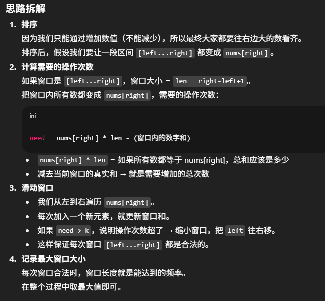

# 1838. Frequency of the Most Frequent Element

## Approach 1 - Sliding window + rolling/prefix sum
我们可以给数组中的元素加数（总共加数 ≤ k），目的是让某个数的出现次数尽可能多。
换句话说，就是把一段区间内的数都变成某个目标数，看能形成的最大频率是多少
- 解题时一定要看contraits, 在Java里面可能出现integer overflow, 所以我们要根据情况用long
- 解题时一定要跳开题目本质求的是什么
- time: O(nlogn)
- space: In Java, Arrays.sort() for primitives is implemented using a variant of the Quick Sort algorithm, which has a space complexity of O(logn)



```java
class Solution {
    public int maxFrequency(int[] nums, int k) { 
        // 1. sort 
        Arrays.sort(nums); 

        // 2. sliding window 
        int left = 0, res = 0;
        long sum = 0; // 注意这里要用 long，防止溢出
        
        for (int i = 0; i < nums.length; i++) { 
            sum += nums[i]; 

            // invalid to shrink window
            // nums[i] * len - sum 前面一定要加long 否则overflow
            while ((long)nums[i] * (i - left + 1) - sum > k) { // left <= i 恒成立
                sum -= nums[left++]; 
            }

            res = Math.max(res,  i - left + 1); 
        }
        return res;
    }
}
```