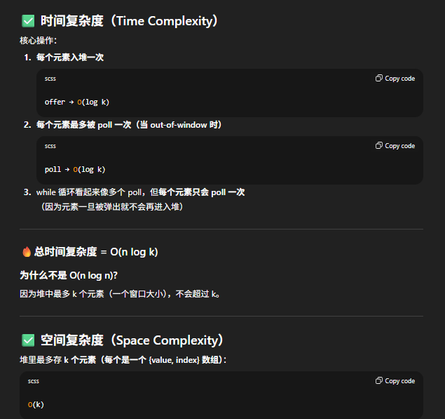
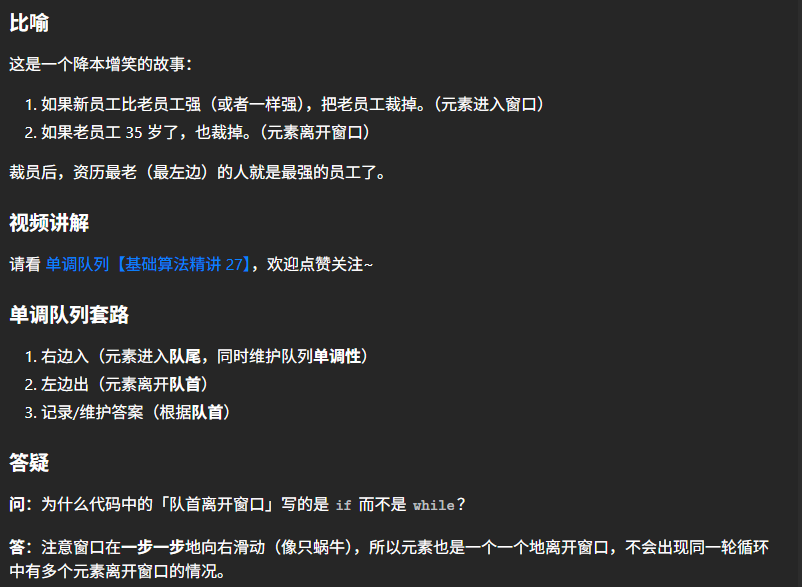
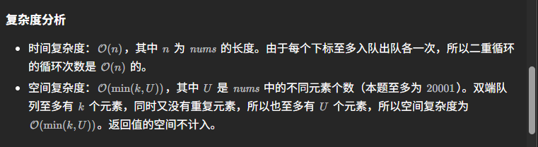

# 239. Sliding Window Maximum

## Approach 1 - PriorityQueue
- 使用滑动窗口 + 最大堆 (Priority Queue) 来维护窗口中的最大值。  
- Priority Queue 中存储 `(num, index)`，既保存值也保存索引。  
- 每次滑动时检查堆顶元素是否已经出界，出界才弹出， 没有出界可以不用管，所以heap里面有可能有>k个数。

## 解题步骤

- **1. 初始化**
  - 窗口大小为 `k`。
  - 把前 `k` 个元素 `(nums[i], i)` 放入最大堆。
  - 堆顶元素即为第一个窗口的最大值，加入结果数组。

- **2. 开始滑动窗口**
  - 从 `i = k` 开始，每次加入新元素 `(nums[i], i)`。
  - 此时堆中可能有 `k+1` 甚至更多个元素。

- **3. 清理过期元素**
  - 检查堆顶元素的 `index` 是否已经 **小于窗口左边界** (`i - k + 1`)。没有出界则不管，可以留在maxHeap内
  - 如果出界，则持续 `poll` 堆顶，直到堆顶元素在当前窗口内。

- **4. 更新结果**
  - 堆顶元素就是当前窗口最大值。
  - 加入结果数组。


## 关键点

- **为什么要存 index？**  
  因为堆中可能还残留窗口外的元素，通过索引判断是否过期。  
- **是否要主动移除窗口最左元素？**  
  不需要逐个定位删除。只需在取最大值时，检查堆顶是否出界，如果出界再弹出即可。  
- **结果数组长度**  
  一定是 `n - k + 1`。

---

## 总结

- Priority Queue 存 `(num, index)`。  
- 插入新元素 → 清理过期元素 → 取堆顶最大值 → 加入结果。  
- 时间复杂度 **O(n log k)**，空间复杂度 **O(k)**。

```java
class Solution {
    public int[] maxSlidingWindow(int[] nums, int k) {
        int n = nums.length;
        int[] res = new int[n-k+1];
        PriorityQueue<int[]> maxHeap = new PriorityQueue<>((a,b) -> (b[0]-a[0]));
        
        for (int i = 0; i < k; i++) {
            maxHeap.offer(new int[]{nums[i], i});
        }
        res[0] = maxHeap.peek()[0];

        for (int i = k; i < n; i++) {
            maxHeap.offer(new int[]{nums[i], i});
            
            // only poll when max's idx is <= i-k, otherwise we dont care. this is the key
            while (!maxHeap.isEmpty() && maxHeap.peek()[1] <= i-k) { // 这里必须用while不能用if， 因为有可能有好几个大的数都已经out of boundray
                maxHeap.poll();
            }
            res[i-k+1] = maxHeap.peek()[0];
        }

        return res;

    }
}
```


## Approach 2 - 灵山茶艾府：单调队列（时间更优化 O(n log k) -> O(n) 更推荐这种做法）


https://www.bilibili.com/video/BV1bM411X72E/




```java
class Solution {
    public int[] maxSlidingWindow(int[] nums, int k) {
        int n = nums.length;
        int[] ans = new int[n - k + 1]; // 窗口个数
        Deque<Integer> q = new ArrayDeque<>(); // 更快的写法见【Java 数组】

        for (int i = 0; i < n; i++) {
            // 1. 右边入
            while (!q.isEmpty() && nums[q.getLast()] <= nums[i]) {
                q.removeLast(); // 维护 q 的单调性 (单调递减)
            }
            q.addLast(i); // 注意保存的是下标，这样下面可以判断队首是否离开窗口

            // 2. 左边出
            int left = i - k + 1; // 窗口左端点
            if (q.getFirst() < left) { // 队首离开窗口
                q.removeFirst();
            }

            // 3. 在窗口左端点处记录答案
            if (left >= 0) { // 加入k = 3, 避免扫描到第二个数时就记录答案
                // 由于队首到队尾单调递减，所以窗口最大值就在队首
                ans[left] = nums[q.getFirst()];
            }
        }

        return ans;
    }
}
```
