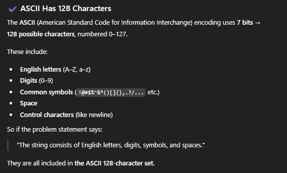

# 3. Longest Substring Without Repeating Characters

## Approach 1

```java
class Solution {
    public int lengthOfLongestSubstring(String s) {
        int n = s.length(), res = 0, right = 0, left = 0;
        char[] chars = new char[128];

        while (right < n) {
            char ch = s.charAt(right);
            
            while (chars[ch] > 0 ) {
                char r = s.charAt(left);
                chars[r]--;
                left++;
            }

            res = Math.max(res, right-left+1);
            chars[ch]++;
            right++;


        }
        
        return res;
    }
}
```

## Approach 2 - HashSet(prefered)

- prefer 这种方法
- time: O(n)
- space: O(1)

```java
class Solution {
    public int lengthOfLongestSubstring(String s) {
        Set<Character> set = new HashSet<>();
        int res = 0;
        int left = 0; 

        // i is the right pointer
        for (int i = 0; i < s.length(); i++) {
            char cur = s.charAt(i);
            
            while (!set.add(cur)) {
                char c = s.charAt(left);
                set.remove(c);
                left++;
            }
            res = Math.max(res, i-left+1);
        }
        return res;
    }
}
```

- 灵山茶艾府写法， 效率更高
- if a string is made of English letters, digits, symbols, and spaces, it fits within the standard 128-character ASCII set.


```java
class Solution {
    public int lengthOfLongestSubstring(String S) {
        char[] s = S.toCharArray(); // 转换成 char[] 加快效率（忽略带来的空间消耗）
        int n = s.length;
        int ans = 0;
        int left = 0;
        boolean[] has = new boolean[128]; // 也可以用 HashSet<Character>，这里为了效率用的数组
        for (int right = 0; right < n; right++) {
            char c = s[right];
            // 如果窗口内已经包含 c，那么再加入一个 c 会导致窗口内有重复元素
            // 所以要在加入 c 之前，先移出窗口内的 c
            while (has[c]) { // 窗口内有 c
                has[s[left]] = false;
                left++; // 缩小窗口
            }
            has[c] = true; // 加入 c
            ans = Math.max(ans, right - left + 1); // 更新窗口长度最大值
        }
        return ans;
    }
}
```