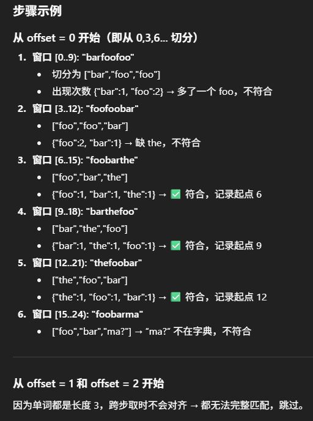

# 30. Substring with Concatenation of All Words

- 这道题有难度  
  - 它不仅仅是一个 **sliding window**  
  - 它还涉及到 **偏移量 (offset)** 的考虑  
  - 这两点加在一起其实就很容易让人迷惑

- 构建 map 的部分比较简单  
  - 就是我们需要的这个 word，它的频率是多少  
  - 每一个 word 出现了几次  
  - 这个过程是非常常规和简单的

- 真正难的是 **sliding window 的过程**  
  - sliding window 的主体就是那个 **while loop**  
  - 不要先去管 outer 的 for loop，只看 while loop
  - 这个 while loop 就是一个 sliding window
  - window 的单位是 **wordLen**  
    - 比如 wordLen = 3，就必须 **每次滑动三个字符**  
    - 因为最终的串是由一个个完整的 word 拼接而成

- sliding window 的滑动方式  
  - 假设用 Example 3 (s = "barfoofoobarthe...", words = ["bar","foo","the"])  
  - 第一个 substring = "bar" → 放进 temp map，count = 1  
  - 第二个 substring = "foo" → 放进 temp map  
  - 第三个 substring = "foo" → 出现了 2 次 foo，而我们只需要 1 次 → 不符合
  - 这个时候要开始缩窗口  
    - 窗口的缩也是 **每次缩进三个字符**，不能一个一个缩  
    - 缩掉 "bar" 后，map 里 foo=2 → 还不行  
    - 再缩掉一个 foo → map 里 foo=1 → 符合

- 在滑动过程中  
  - 如果 map 里出现次数超过所需，就要不断缩左边窗口，直到符合  
  - 如果遇到一个不在字典里的单词  
    - 整个 map 清空  
    - count = 0  
    - 左指针移动到右指针  
    - 因为不在字典的单词不可能成为答案的一部分

- 找到符合条件时  
  - 当 count == words.length 时，说明正好匹配  
  - 把当前 left 作为结果索引加入答案  
  - 然后继续往右滑，维持窗口状态

- outer 的 for loop（偏移量的考虑）  
  - wordLen = 3，就要从 offset = 0,1,2 三个位置开始切分  
  - 为什么要这样？  
    - 因为答案的起点不一定和 0 对齐  
    - 举例：如果 s = "afoobar"，words = ["foo","bar"]  
      - 从 offset=0 开始切就是 [afo][oba]，完全对不上  
      - 但 offset=1 开始就是 [foo][bar]，正好匹配  
  - 所以必须 loop 0~wordLen-1 来覆盖所有情况  
  - 从 4 开始切没有意义，因为等价于从 1 开始切  
  - 因此只需要 0 到 wordLen-1 就够了

- 总结  
  - while loop 是标准的 sliding window，每次走 wordLen  
  - for loop 是为了保证所有 offset 都能覆盖  
  - 把这两点想清楚，这题就不再那么难了

- **流程总结**  
  - Step 1: 读取下一个 substring（长度 = wordLen）  
  - Step 2: 如果在字典里 → 加入 map，更新 count  
  - Step 3: 如果某个 word 出现次数超过所需 → 缩左窗口，直到符合  
  - Step 4: 如果 count == words.length → 记录答案  
  - Step 5: 如果遇到不在字典的 word → 清空 map，重置窗口  
  - Step 6: 重复以上步骤，直到遍历结束




```java
class Solution {
    public List<Integer> findSubstring(String s, String[] words) {
        List<Integer> result = new ArrayList<>();
        if (s == null || s.length() == 0 || words == null || words.length == 0) return result;

        int wordLen = words[0].length();          // 每个单词长度： 3
        int wordCount = words.length;             // 单词总数： 3
        int totalLen = wordLen * wordCount;       // 总拼接长度： 9

        if (s.length() < totalLen) return result;

        // 1. 构建 words 的词频表
        Map<String, Integer> wordCountMap = new HashMap<>();
        for (String w : words) {
            wordCountMap.put(w, wordCountMap.getOrDefault(w, 0) + 1);
        }

        // 2. 遍历不同的起始偏移（0 到 wordLen-1）
        for (int i = 0; i < wordLen; i++) { // i= 0
            int left = i, right = i;
            Map<String, Integer> seen = new HashMap<>();
            int count = 0; // 已匹配的单词数

            // normal sliding window
            while (right + wordLen <= s.length()) { // <= 因为是左闭右开区间
                // 取出下一个单词
                String word = s.substring(right, right + wordLen);// 6~9, foo
                right += wordLen; // right = 9

                // 如果这个单词在字典里
                if (wordCountMap.containsKey(word)) {
                    seen.put(word, seen.getOrDefault(word, 0) + 1);
                    count++; // count  = 3

                    // 如果超过需要的次数 → 缩小窗口
                    while (seen.get(word) > wordCountMap.get(word)) {
                        String leftWord = s.substring(left, left + wordLen);
                        seen.put(leftWord, seen.get(leftWord) - 1);
                        left += wordLen; // left = 6
                        count--; // count = 1
                    }

                    // 如果正好匹配 M 个单词
                    if (count == wordCount) { // 2 == 3？
                        result.add(left);
                    } // res: [ ]
                } else {
                    // 不在字典 → 清空窗口
                    seen.clear();
                    count = 0;
                    left = right;
                }
            }
        }
        return result;
    }
}
```

- 另一种写法，统计word种类而不是total wordcount
```java
class Solution {
    public List<Integer> findSubstring(String s, String[] words) {
        List<Integer> res = new ArrayList<>();
        HashMap<String, Integer> map = new HashMap<>();
        int wordLen = words[0].length();
        int wordCount = words.length;
        int totalLen = wordLen * wordCount;

        if (s.length() < totalLen) return res;

        for (String word: words) {
            map.put(word, map.getOrDefault(word, 0)+1);
        }

        for (int i = 0; i < wordLen; i++) {
            int left = i, right = i, count = 0;
            HashMap<String, Integer> window = new HashMap<>();

            while (right + wordLen <= s.length()) {
                String word = s.substring(right, right + wordLen);
                right += wordLen;

                if (map.containsKey(word)) {
                    window.put(word, window.getOrDefault(word, 0)+1);
                    if (window.get(word).equals(map.get(word))) count++;
                    
                    while (window.get(word) > map.get(word)) {
                        String leftWord = s.substring(left, left + wordLen);
                        if (window.get(leftWord).equals(map.get(leftWord))) count--;
                        window.put(leftWord, window.get(leftWord)-1);
                        left += wordLen;
                    }

                    if (count == map.size()) res.add(left);
                } else {
                    count = 0;
                    window.clear();
                    left = right;
                }
            }
        }
        return res;
    }
}


```

- time: O(N/L * L) = O(N * L)
- space: O（M) M = words.length;