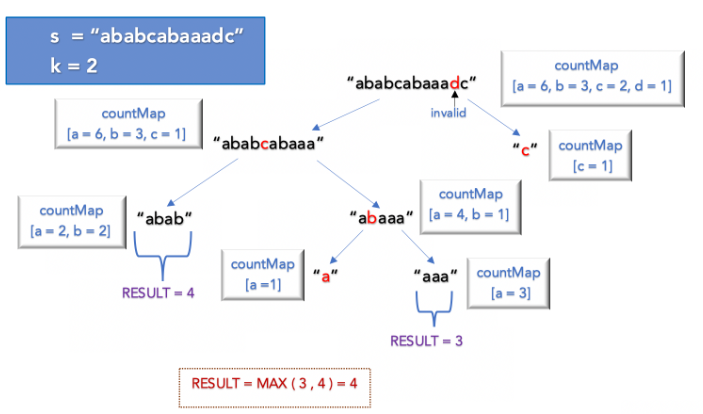

# 395. Longest Substring with At Least K Repeating Characters

## Approach 1 - Divide and Conquer



The string would be split only when we find an invalid character. An invalid character is the one with a frequency of less than k. As we know, the invalid character cannot be part of the result, we split the string at the index where we find the invalid character, recursively check for each split, and combine the result.
- Base case: If the length of the current substring (end - start) is less than k, the method returns 0, as it is impossible to have a substring with at least k repeating characters.
- Build the countMap with the frequency of each character in the string s.
- Find the position for mid index by iterating over the string. The mid index would be the first invalid character in the string.
- To make it more efficient, we ignore all the invalid characters after the mid index as well, thereby reducing the number of recursive calls.
    - aabcdxxx, mid = b, midnext = x, 中间cd被跳过更efficiet, 因为他们本身也不valid, 所以不用以它们为mid来分，直接跳过
- Split the string into 2 substrings at the mid index and recursively find the result.

```java
class Solution {
    public int longestSubstring(String s, int k) {
        return longestSubstringUtil(s, 0, s.length(), k);
    }

    int longestSubstringUtil(String s, int start, int end, int k) {
        // 1. base case: string length < k, never goona find valid substring
        if (end < k) return 0;
        
        // 2. countMap track char freq
        int[] countMap = new int[26];
        for (int i = start; i < end; i++)
            countMap[s.charAt(i) - 'a']++;
        
        // 3-1. find split index 
        for (int mid = start; mid < end; mid++) {
            if (countMap[s.charAt(mid) - 'a'] >= k) continue;
            int midNext = mid + 1;
            while (midNext < end && countMap[s.charAt(midNext) - 'a'] < k) midNext++;
            return Math.max(longestSubstringUtil(s, start, mid, k),
                    longestSubstringUtil(s, midNext, end, k));
        }
        // 3-2. if the whole string is valid, return it's length (end-start)
        return (end - start);
    }
}
```
- time: O(N^2)
    - Each level of recursion involves iterating over the substring once (O(N)).
    - In the worst case, the depth of recursion can be O(N) because in the worst case, the substring might be split into two parts recursively for each non-repeating character
    - Therefore, the total time complexity is O(N^2). This is because, in the worst case, for every level of recursion (which can be up to N), we perform a linear scan over the string, leading to a O(N) * O(N) = O(N^2) time complexity.
- Space: O(N), This is the space used to store the recursive call stack. The maximum depth of recursive call stack would be O(N)


## Approach 2 - Sliding window （更快）


- 时间和空间上都更优化了，但是方法稍微难理解一点
- 这是一种非常巧妙的解法，这道题本来没法用sliding window, 因为它求的是最长，你不知道该expand window 还是shrink window. 所以我就给它加上一个限制条件，当window中unique 字母分别为1个，两个，三个。。。直到26个时，这26中情况下的满足条件的最长substring为多少，正确答案就在其中一种情况中，又因为只有26个字母/26种情况，时间也很快。
    - 这道道题本质就是 sliding window 模板 + 循环用26次

```java
class Solution {
   public int longestSubstring(String s, int k) {
        int res = 0;
        
        // Iterate over the number of unique characters allowed in the substring
        for (int unique = 1; unique <= 26; unique++) {
            Map<Character, Integer> map = new HashMap<>();
            int left = 0, validCount = 0;

            for (int i = 0; i < s.length(); i++) {
                char c = s.charAt(i);
                map.put(c, map.getOrDefault(c, 0) + 1);
                
                // When a character frequency reaches k, it's considered valid
                if (map.get(c) == k) validCount++; // 必须是 == k, > k不能incrase validCount, 比如 k= 2, window里出现第三个a, validcount 不能增加

                // Shrink the window if we have more unique characters than allowed
                while (map.size() > unique) {
                    char leftChar = s.charAt(left);
                    map.put(leftChar, map.get(leftChar) - 1);
                    if (map.get(leftChar) == k-1) validCount--; // 只能是k-1,表示减少之前是k,是从valid 变成 invalid。 <k 不行，a freq =2, k=3, a从2变成1，<k, 但是a从来都不在validcount里面，validcount不能减少
                    if (map.get(leftChar) == 0) map.remove(leftChar);
                    left++;
                }

                // Check if the current window is valid
                // 这个判断条件也很难想
                // map.size() == unique ，当前为valid window
                // validCount == unique, 表示窗口里每一个字母都符合条件: 出现次数>=k
                if (map.size() == unique && validCount == unique) {
                    res = Math.max(res, i - left + 1);
                }
            }
        }
        
        return res;
    }
}
```
- time: O(N)
- Space: O(1)