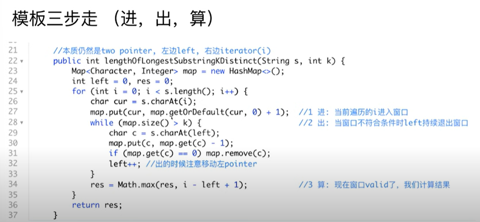
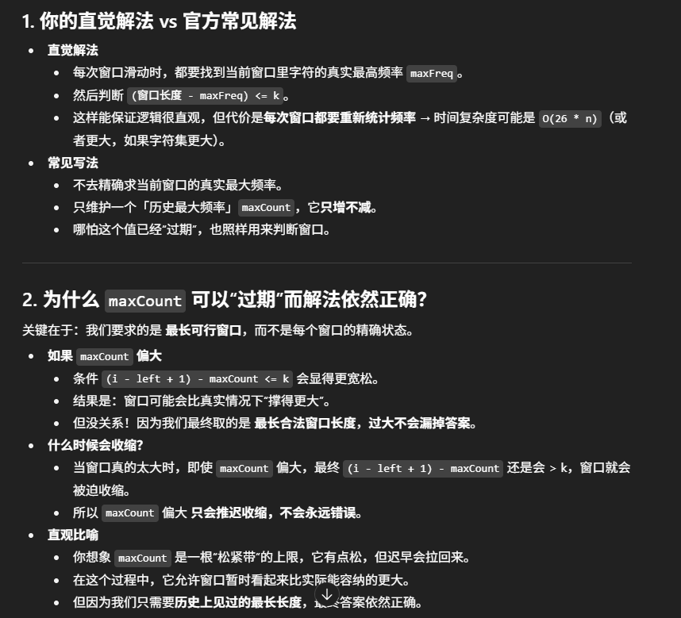
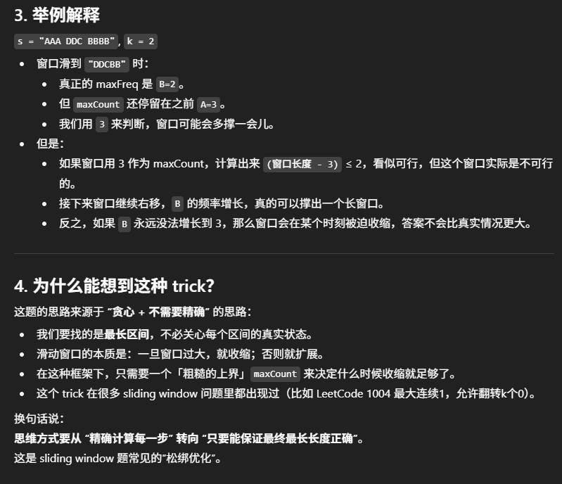

# 424. Longest Repeating Character Replacement

## Sliding window template


## Approach
- 题目： 出现不同字母时，只要不超过k个不同字母，我们都认为是相同的，求相同字母最长是多长，return 长度
- 如何转化该题目： 
    - 每一个字母进入时，计算频率
    - 我们用maxCount来记录目前为止频率最高字母的频率, 我们需要记录的是目前为止出现的最高频率，而不是窗口内字母的最高频率，因为答案一定会包括频率最高的字母
    - window 长度为i-left+1 vs. maxCount, 比如k= 1, windown contains AAB, maxCount = 2, windown length = 3, 3-2 <=1, ok, valid, 只有一个不同的字母，此时我们可以计算res = 3; 当window 变成 AABB, maxCount = 2, windown length = 4, 4-2>1, 此时我们要收缩窗口，当窗口变成"ABB"时，valid,再计算res
    - 总结： 仍是是 进-->出-->算 的套路

    
    

```java
class Solution {
    public int characterReplacement(String s, int k) {
        int[] count = new int[26];
        int left = 0, res = 0, maxCount = 0;

        for (int i = 0; i < s.length(); i++) {
            char cur = s.charAt(i);
            count[cur-'A']++;
            maxCount = Math.max(maxCount, count[cur-'A']); //用于记录当下字母出现的最高频率

            while ((i-left+1) - maxCount > k) {
                char c = s.charAt(left);
                count[c-'A']--;
                left++;
            }
            res = Math.max(res, i-left+1);
        }
        return res;
    }
}
```

- time: O(N)
- space: O(1)