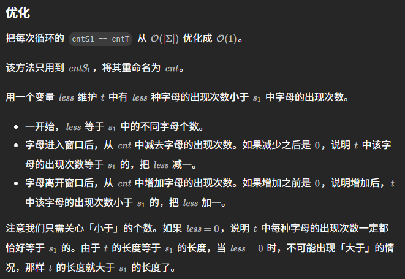

# 567. Permutation in String

## Approach 1

- 移动一个固定长度的窗口
- 把permutation的问题直接转换比较两个count character freq的array是否相等
- s1Count and s2count have fixed length 26, so comparison between those two arrays is O(1) time.

```java
class Solution {
    public boolean checkInclusion(String s1, String s2) {
        if (s1.length() > s2.length()) return false;
        int windowSize = s1.length();
        int[] s1Count = new int[26];    
        int[] s2Count = new int[26];    
    
        for (int i = 0; i < windowSize; i++) {
            s1Count[s1.charAt(i)-'a']++;
            s2Count[s2.charAt(i)-'a']++;
        }

        if (Arrays.equals(s1Count, s2Count)) return true;

        for (int i = windowSize; i < s2.length(); i++) {
            s2Count[s2.charAt(i)-'a']++;
            s2Count[s2.charAt(i-windowSize)-'a']--;
            if (Arrays.equals(s1Count, s2Count)) return true; // O(1)
        }
        return false;
    }
}
```
- Time Complexity: O(s2.length) (efficient for large inputs)
- Space Complexity: O(1) (only constant extra space used)

- 灵山茶艾府写法
```java
class Solution {
    public boolean checkInclusion(String s1, String s2) {
        int m = s1.length();
        if (m > s2.length()) {
            return false;
        }

        // 统计 s1 的每种字母的出现次数
        int[] cntS1 = new int[26];
        for (char c : s1.toCharArray()) {
            cntS1[c - 'a']++;
        }

        char[] s = s2.toCharArray();
        int[] cntT = new int[26]; // 对于 s2 的长为 m 的子串 t，统计 t 的每种字母的出现次数
        for (int i = 0; i < s.length; i++) {
            // 1. 进入窗口
            cntT[s[i] - 'a']++;
            if (i < m - 1) { // 窗口大小不足 m
                continue;
            }
            // 2. 判断子串 t 的每种字母的出现次数是否均与 s1 的相同
            if (Arrays.equals(cntS1, cntT)) {
                return true;
            }
            // 3. 离开窗口，为下一个循环做准备
            cntT[s[i - m + 1] - 'a']--;
        }
        return false;
    }
}
```

## Approach 2 - 对approach 1的优化（推荐，但是比较难想）



这是对上一版 **O(26 * N)** 解法的优化版本。上一版做法是在 `s2` 的每个窗口都对比整个 freq array，因此有常数 26。

为了做到 **真正的 O(N)**，我们在滑动窗口中 **不再每次比较两个 frequency array**，而是使用一个关键变量：

### 🧩 `less` —— 记录还剩多少种 unique 字符没有凑齐

- 先对 `s1` 统计 frequency。
- 统计 `s1` 里有多少种不同的字符，例如 `a, b, e` ⇒ `less = 3`。
- 滑动窗口遍历 `s2`，每遇到一个新进入窗口的字符，做一次 freq--。
- **当某个字符 freq 从 1 变成 0 时，说明这个字符完全凑齐 → `less--`**。
- 只要 `less == 0`，说明当前窗口完全包含了 `s1` 所需的所有字符 → return `true`。


## 🏃‍♂️ Sliding Window 过程（进入窗口 vs 离开窗口）

1. **窗口右侧进入新字符（inChar）**

count[inChar]--

若 count[inChar] == 0，说明刚好凑齐 → less--


2. 窗口左侧移出旧字符（outChar）

若 count[outChar] == 0，说明原本是完全凑齐的，此时移出会破坏 → less++  

然后再 count[outChar]++

```java
class Solution {
    public boolean checkInclusion(String s1, String s2) {
        int m = s1.length();
        if (m > s2.length()) {
            return false;
        }

        int[] cnt = new int[26];
        int less = 0;
        for (char c : s1.toCharArray()) {
            if (cnt[c - 'a'] == 0) {
                less++;
            }
            cnt[c - 'a']++;
        }

        char[] s = s2.toCharArray();
        for (int i = 0; i < s.length; i++) {
            // 1. 进入窗口
            int c = s[i] - 'a';
            cnt[c]--;
            if (cnt[c] == 0) {
                less--;
            }

            if (i < m - 1) { // 窗口大小不足 m
                continue;
            }

            // 2. 判断子串 t 的每种字母的出现次数是否均与 s1 的相同
            if (less == 0) {
                return true;
            }

            // 3. 离开窗口，为下一个循环做准备
            int out = s[i - m + 1] - 'a';
            if (cnt[out] == 0) {
                less++;
            }
            cnt[out]++;
        }
        return false;
    }
}
```