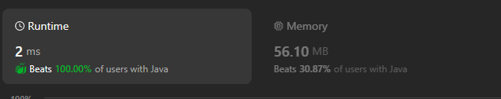
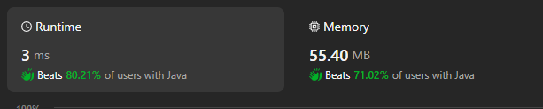

# 643. Maximum Average Subarray I

[Leetcode 643 (Easy)][643]

[643]: https://leetcode.com/problems/maximum-average-subarray-i/description/?envType=study-plan-v2&envId=leetcode-75


## Approach 1

```java
class Solution {
    public double findMaxAverage(int[] nums, int k) {
        int sum = 0;
        for(int i=0; i<k; i++) {
            sum += nums[i];
        }
        int maxSum = sum;
        for(int i=k; i<nums.length; i++) {
            sum += nums[i] - nums[i-k];
            maxSum = Math.max(sum, maxSum); 
        }
        return (double)maxSum/k;
    }
}
```

## Approach 2
```java
class Solution {
    public double findMaxAverage(int[] nums, int k) {
        int i = 0;
        int j = 0;
        double sum = 0;
        double max = 0;

        while (j < k) {
            sum += nums[j];
            j++;
        }
        max = sum;

        while (j < nums.length) {
            sum += nums[j] - nums[i];
            if(max<=sum){
                max=sum;
            }
           
            i++;
            j++;
        }

        return max / k;
    }
}
```


## Approach 2 by Lei

```java
class Solution {
    public double findMaxAverage(int[] nums, int k) {
        double max = Integer.MIN_VALUE;
        int left = 0;
        int right = 0;
        int total = 0;

        while (right < nums.length) {
            total += nums[right];

            if ((right-left+1) == k) { // 满足条件就缩小窗口
                if (total > max) max = total;
                total -= nums[left]; //缩小窗口
                left++; //缩小窗口
            }
            right++;
        }
        return (double) max/k;
    }
}
```