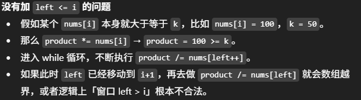

# 713. Subarray Product Less Than K

## Approach: rolling sum + sliding window



```java
class Solution {
    public int numSubarrayProductLessThanK(int[] nums, int k) {
        int product = 1;
        int res = 0, left = 0;

        for (int i = 0; i < nums.length; i++) { /
            product *= nums[i];

            while (product >= k && left <= i) {
                product /= nums[left++]; 
            } 

            res += i - left + 1; // calculates how many valid subarrays end at index i
        }
        return res;   
    }
}
```