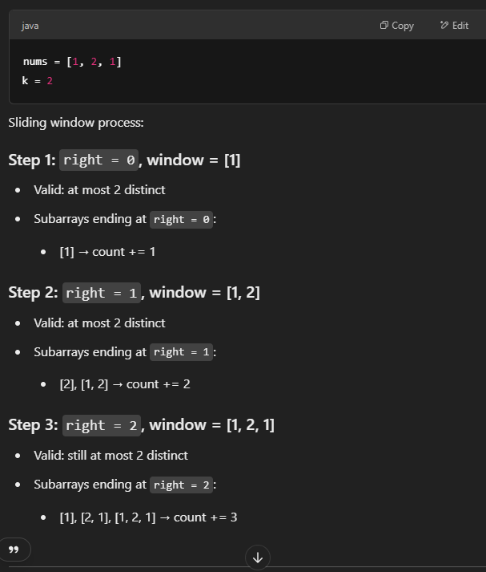

# 992. Subarrays with K Different Integers

## Approach 1 - Sliding window

This method is easy to implement but hard to understand
- It's hard to count number of subarrays for exactly k distint numbers. So we transform it to
    - counts subarrays with 1 to K distinct elements
    - counts subarrays with 1 to K-1 distinct elements
    - So their difference gives us subarrays with exactly K distinct elements
- Helper function atMostK helps count the number of subarrays for most k distint numbers and k-1 distinct numbers
    - 要理解一个计算，在当前window满足 distinct numbers <= k时，如何计算number of subarrays?
    - number of subarrays 指的是当前window valid时， number of subarrays ends at right (为了避免重复计算)
    - count = right - left +1; 


```java
class Solution {
    public int subarraysWithKDistinct(int[] nums, int k) {
        return atMost(nums, k) - atMost(nums, k-1);
    }

    private int atMost(int[] nums, int k) {
        Map<Integer, Integer> map = new HashMap<>();
        int numberOfSubarrays = 0, left = 0;

        for (int i = 0; i < nums.length; i++) {
            map.put(nums[i], map.getOrDefault(nums[i], 0)+1);

            while (map.size() > k) {
                int num = nums[left];
                map.put(num, map.get(num)-1);
                if (map.get(num) == 0) map.remove(num);
                left++;
            }
            numberOfSubarrays += i-left+1;
        }
        return numberOfSubarrays;
    }
}
```