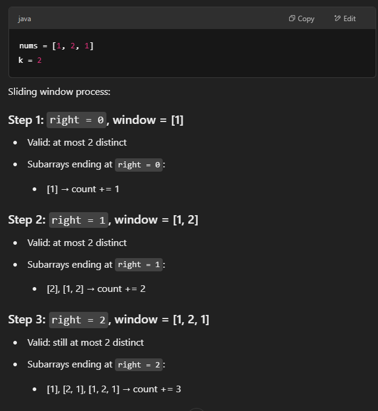
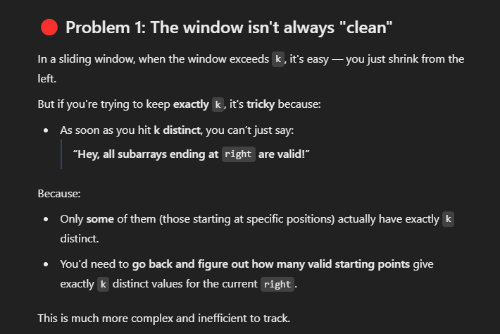
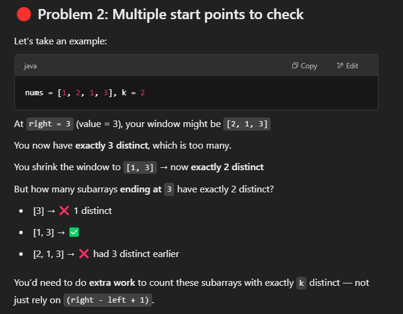

# 992. Subarrays with K Different Integers

- 这道题的实现其实非常简单，就是一个标准的 **sliding window**
- 难点不在写法，而在于你要看穿它的 **trick**

- 思路
  - 题目要求 **subarrays with k different integers**
  - 举个例子：数组 [1,2,1,2,3]，k=2
    - [1,2] 是符合条件的
    - 但是问题来了：你怎么知道这一段里面到底有多少 subarray 是符合的？
  - 我们通常会用 **hashmap** 去统计窗口里不同元素的个数
    - 当 map.size == k 的时候，你会觉得这段是符合条件的
    - 比如 [1,2]，它的 map.size=2，看起来没问题
    - 但是注意：以 2 结尾的所有 subarray 有 (i-left+1) 个
    - 你一股脑都加上了，就会包含 [2] 这种不符合条件的
    - 所以你没办法很直接地把那些“不符合的”剔除掉

- 转换思路
  - 如果把题目换成 **at most K different integers**，就非常简单
    - 这是一个经典的 sliding window
    - 当窗口里不同数多于 k，就 shrink
    - 否则就往前走
    - 每次更新结果时：res += (i-left+1)
  - 但是我们要求的是 **exactly K**，不是 at most

- 关键的 trick
  - **exactly K = atMost(K) - atMost(K-1)**
  - 也就是说：
    - 先写一个函数算 “最多有 K 个不同数的 subarray 数量”
    - 再写一个算 “最多有 K-1 个不同数的 subarray 数量”
    - 两个一减，就得到了 “正好有 K 个不同数的 subarray 数量”

- 总结
  - 这题的实现非常简洁
  - 精髓在于把问题 **转化成 at most**，然后用差值得到 exactly

## Approach 1 - Sliding window

This method is easy to implement but hard to understand. 方法是把exactly k 转换成求 atmost K - atmost k-1. 类似题目还有1248
- It's hard to count number of subarrays for exactly k distint numbers. So we transform it to
    - counts subarrays with 1 to K distinct elements
    - counts subarrays with 1 to K-1 distinct elements
    - So their difference gives us subarrays with exactly K distinct elements
- Helper function atMostK helps count the number of subarrays for most k distint numbers and k-1 distinct numbers
    - 要理解一个计算，在当前window满足 distinct numbers <= k时，如何计算number of subarrays?
    - number of subarrays 指的是当前window valid时， number of subarrays ends at right (为了避免重复计算)
    - count = right - left +1; 


```java
class Solution {
    public int subarraysWithKDistinct(int[] nums, int k) {
        // It is hard calcualte exactly at k, so we transforms this to difference between at most k and at most k-1;
        return atMost(nums, k) - atMost(nums, k-1);
    }
    
    // template: enter - invalid shrink - calculate
    private int atMost(int[] nums, int k) {
        Map<Integer, Integer> map = new HashMap<>();
        int numberOfSubarrays = 0, left = 0;

        for (int i = 0; i < nums.length; i++) {
            map.put(nums[i], map.getOrDefault(nums[i], 0)+1);

            while (map.size() > k) {
                int num = nums[left];
                map.put(num, map.get(num)-1);
                if (map.get(num) == 0) map.remove(num);
                left++;
            }
            // need to understand:
            // why we care about number of subarrays ends at right
            // why the count = right - left +1 ;
            numberOfSubarrays += i-left+1; 
        }
        return numberOfSubarrays;
    }
}
```

why directly calculating exact k is hard?

