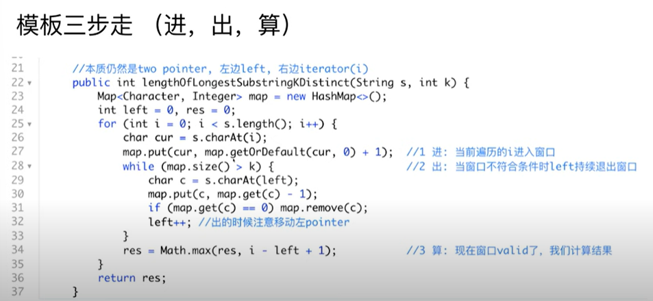

# Sliding Window Notes
[labuladong sliding window](https://labuladong.online/algo/essential-technique/sliding-window-framework/)

## Template
- 字串一般需要用到sliding window
- 什么时候应该移动 right 扩大窗口？窗口加入字符时，应该更新哪些数据？
- 什么时候窗口应该暂停扩大，开始移动 left 缩小窗口？从窗口移出字符时，应该更新哪些数据？
- 我们要的结果应该在扩大窗口时还是缩小窗口时进行更新？
- 窗口为左闭右开 [left, right)；left & left之间为窗口
- Time complexity： 一般为O(n)，每个ele 只会进入窗口一次

```java
// 注意：java 代码由 chatGPT🤖 根据我的 cpp 代码翻译，旨在帮助不同背景的读者理解算法逻辑。
// 本代码不保证正确性，仅供参考。如有疑惑，可以参照我写的 cpp 代码对比查看。

import java.util.HashMap;
import java.util.Map;

public class Main {
    /* 滑动窗口算法框架 */
    public static void slidingWindow(String s) {
        // 用合适的数据结构记录窗口中的数据，根据具体场景变通
        // 比如说，我想记录窗口中元素出现的次数，就用 map
        // 我想记录窗口中的元素和，就用 int
        Map<Character, Integer> window = new HashMap<>();
        
        int left = 0, right = 0;
        while (right < s.length()) {
            // c 是将移入窗口的字符
            char c = s.charAt(right);
            window.put(c, window.getOrDefault(c, 0) + 1);
            // 增大窗口
            right++;
            // 进行窗口内数据的一系列更新
            // ...

            /*** debug 输出的位置 ***/
            // 注意在最终的解法代码中不要 print
            // 因为 IO 操作很耗时，可能导致超时
            System.out.printf("window: [%d, %d)\n", left, right);
            /********************/
            
            // 判断左侧窗口是否要收缩
            while (left < right && window needs shrink) {
                // d 是将移出窗口的字符
                char d = s.charAt(left);
                window.put(d, window.get(d) - 1);
                // 缩小窗口
                left++;
                // 进行窗口内数据的一系列更新
                // ...
            }
        }
    }

    public static void main(String[] args) {
        slidingWindow("your string here");
    }
}

```