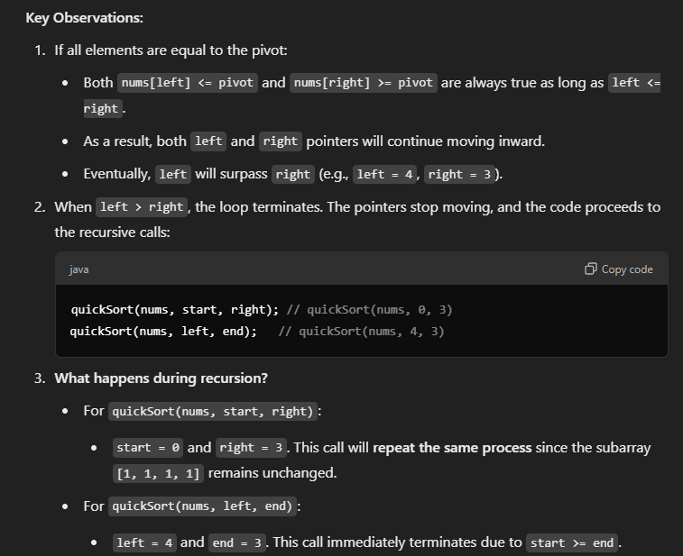

# Advanced Sort

## Quick Sort

### 方法： 先整体再局部
- 把array分成两半 （长度不一定相等）
- 使得左边所有数字 < 右边所有数
- 再把左右两边分别排序

## Steps
- select pivot
- partition
- recursion for subarray

## time & space
- time: O(nlogn) -- O(n^2)
- space: O(logn) -- O(n);
    - logn 是高度

```java
 public static void sortInt(int[] nums) {
        if (nums == null || nums.length == 0) {
            return;
        }

        quickSort(nums, 0, nums.length-1);
    }

    public static void quickSort(int[] nums, int start, int end) {
        // start == end, 只有一个数字，直接return
        if (start >= end) {
            return;
        }

        int left = start, right = end;
        int pivot = nums[left + (right - left)/2]; // 避免overflow;

        // must to be <=, if left < right, will lead to stack overflow. 当两个指针重合时，比较一次各自走一步， = 保证两个指针错开
        while (left <= right) {
            while (left <= right && nums[left] < pivot) { // 此处不能 =， 如果有 = ， 一个数组全是1，出现stack overflow
                left++;
            }

            while (left <= right && nums[right] > pivot) { // 此处不能 =
                right--;
            }

            if (left <= right) {
                int temp = nums[left];
                nums[left] = nums[right];
                nums[right] = temp;
                left++;
                right--;
            }
        }

        // start & right, left & end, 是因为right and left 走错开了
        quickSort(nums, start, right);
        quickSort(nums,left, end);
    }

```



## Merge Sort

### 方法： 先局部后整体
- 把数字平均的分成左右两半
- 分别排序
- 新开一个数组去merge, 再更新原有array

### time and space
- time: stable O(nlogn); it is actually more stable and supposed to be faster than quicksort, becuase quicksort could be as slow as O(n^2);
- space: O(n), 需要新开数字来merge, 导致quicksort is more preferred 

```java
public static void sortIntegers1(int[] nums) {
        if (nums == null || nums.length == 0) {
            return;
        }
        int[] temp = new int[nums.length];
        mergeSort(nums, 0, nums.length-1, temp);
    }

    public static void mergeSort(int[] nums, int start, int end, int[] temp) {
        if (start >= end) {
            return;
        }
        int mid = start + (end - start)/2;
        mergeSort(nums, start, mid, temp);
        mergeSort(nums, mid+1, end, temp);
        merge(nums, start, mid+1, end, temp);
    }

    public static void merge(int[] nums, int leftStart, int rightStart, int end, int[] temp) {
        int index = leftStart;
        int mid = rightStart-1;

        while (leftStart <= mid && rightStart <= end) {
            if (nums[leftStart] < nums[rightStart]) {
                temp[index++] = nums[leftStart++];
            } else {
                temp[index++] = nums[rightStart--];
            }
        }

        while (leftStart <= mid) {
            temp[index++] = nums[leftStart++];
        }

        while (rightStart <= end) {
            temp[index++] = nums[rightStart--];
        }

        for (int i = leftStart; i <= end; i++) {
            nums[i] = temp[i];
        }
    }
```

## Java sort methods
### Custom comparator

```java
// approach 1
int[][] pairs = new int[][] {{1, 2}, {5,8}, {3, 5}, {2, 2}, {5,9},{2, 4}};
Arrays.sort(pairs, (a,b)->(a[0] == b[0]? a[1] - b[1]: a[0]: b[0]));
System.out.println(Arrays.deepToString(pairs));

// approach 2
Comparator<int[]> comparator = new Comparator<int[]>() {
            @Override
            public int compare(int[] o1, int[] o2) {
                if (o1[0] == o2[0]) {
                    // Compare based on the second element in descending order
                    return o1[1] - o2[1];
                } else {
                    // Compare based on the first element in ascending order
                    return o1[0] - o2[0];
                }
            }
        };

int[][] pairs = new int[][] {{1, 2}, {5,8}, {3, 5}, {2, 2}, {5,9},{2, 4}};
Arrays.sort(pairs, comparator);
System.out.println(Arrays.deepToString(pairs));
```java
