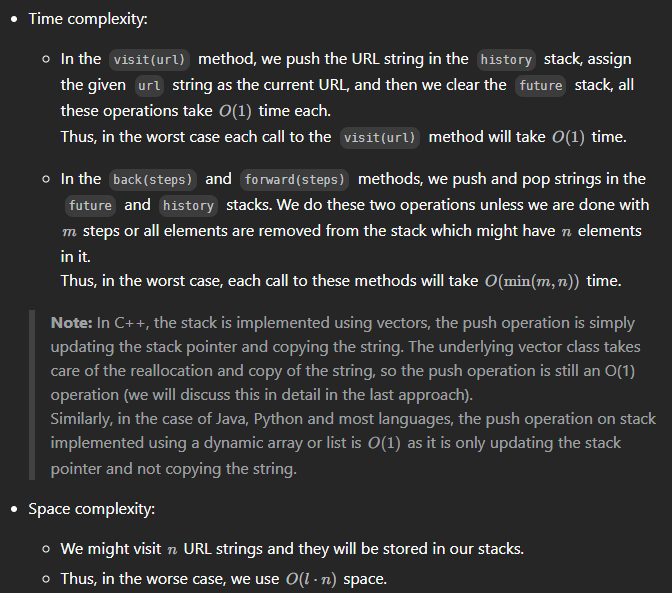

# 1472. Design Browser History

## approach 1 by Lei - two Stacks

```java
class BrowserHistory {
    private Deque<String> backStack;
    private Deque<String> forwardStack; 

    public BrowserHistory(String homepage) {
        backStack = new ArrayDeque<>();
        forwardStack = new ArrayDeque<>();
        backStack.push(homepage);
    }
    
    public void visit(String url) {
        backStack.push(url);
        if (!forwardStack.isEmpty()) forwardStack.clear();
    }
    
    public String back(int steps) {
        while (backStack.size() > 1 && steps > 0) {
            forwardStack.push(backStack.pop());
            steps--;
        }
        return backStack.peek();
    }
    
    public String forward(int steps) {
        while (!forwardStack.isEmpty() && steps > 0) {
            backStack.push(forwardStack.pop());
            steps--;
        }
        return backStack.peek();
    }
}
```

- 另一種寫法

```java
class BrowserHistory {
    private Deque<String> backStack;
    private Deque<String> forwardStack;
    private String current; 

    public BrowserHistory(String homepage) {
        backStack = new ArrayDeque<>();
        forwardStack = new ArrayDeque<>();
        current = homepage;
    }
    
    public void visit(String url) {
        backStack.push(current);
        if (!forwardStack.isEmpty()) forwardStack.clear();
        current = url;
    }
    
    public String back(int steps) {
        while (!backStack.isEmpty() && steps > 0) {
            forwardStack.push(current);
            current = backStack.pop();
            steps--;
        }
        return current;
    }
    
    public String forward(int steps) {
        while (!forwardStack.isEmpty() && steps > 0) {
            backStack.push(current);
            current = forwardStack.pop();
            steps--;
        }
        return current;
    }
}
```

